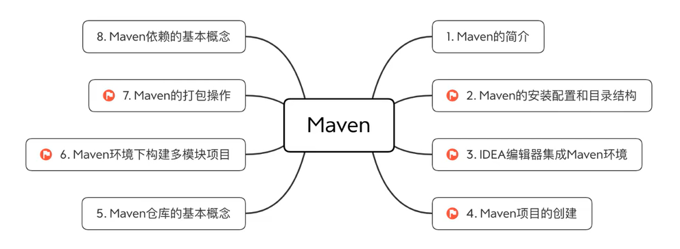

# Maven

## 1. 主要内容



## 2. Maven的简介

### 2.1. 简介

Maven【[ˈmevən]】这个词可以翻译为"专家","内⾏"。作为Apache组织中的⼀个颇为成功的开源项⽬，Maven主要服务于基于java平台的**项⽬构建**，**依赖管理**和**项⽬信息管理**。

⽆论是⼩型的开源类库项⽬，还是⼤型的企业级应⽤； ⽆论是传统的瀑布式开发，还是流⾏的敏捷开发，Maven都能⼤显身⼿。
    
### 2.2. 项⽬构建

不管你是否意识到，构建（build）是每⼀位程序员每天都在做的⼯作。早上来到公司，我们做的第⼀件事就是从源码库签出最新的代码，然后进⾏单元测试，如果测试失败，会找相关的同事⼀起调试，修复错误代码。接着回到⾃⼰的⼯作上来，编写⾃⼰的单元测试及产品代码。

仔细总结⼀下，我们会发现，除了编写源代码，我们每天有相当⼀部分时间花在了编译，运⾏单元测试，⽣成⽂档，打包和部署等繁琐且不起眼的⼯作上，这就是构建。 如果我们现在还⼿⼯这样做，那成本也太⾼了，于是有⼈⽤软件的⽅法让这⼀系列⼯作完全⾃动化，使得软件的构建可以像全⾃动流⽔线⼀样，只需要⼀条简单的命令，所有繁琐的步骤都能够⾃动完成，很快就能得到最终结果。

### 2.3. 项⽬构建⼯具

**Ant构建**

最早的构建⼯具，基于IDE,⼤概是2000年有的，当时是最流⾏java构建⼯具，不过它的XML脚本编写格式让XML⽂件特别⼤。对⼯程构建过程中的过程控制特别好

**Maven【JAVA】**

项⽬对象模型，通过其描述信息来管理项⽬的构建，报告和⽂档的软件项⽬管理⼯具。它填补了Ant缺点，Maven第⼀次⽀持了从⽹络上下载的功能，仍然采⽤xml作为配置⽂件格式。Maven专注的是依赖管理，使⽤Java编写。

**Gradle**

属于结合以上两个的优点，它继承了Ant的灵活和Maven的⽣命周期管理，它最后被google作为了Android御⽤管理⼯具。它最⼤的区别是不⽤XML作为配置⽂件格式，采⽤了DSL格式，使得脚本更加简洁。

⽬前市⾯上Ant⽐较⽼，所以⼀般是⼀些⽐较传统的软件企业公司使⽤，Maven使⽤Java编写，是当下⼤多数互联⽹公司会使⽤的⼀个构建⼯具，中⽂⽂档也⽐较⻬全，gradle是⽤groovy编写，⽬前⽐较新型的构建⼯具⼀些初创互联⽹公司会使⽤，以后会有很⼤的使⽤空间。

### 2.4. Maven的四⼤特性

#### 2.4.1. 依赖管理系统

Maven为Java世界引⼊了⼀个新的依赖管理系统jar包管理jar升级时修改配置⽂件即可。在Java世界中，可以⽤groupId、artifactId、version组成的Coordination（坐标）唯⼀标识⼀个依赖。

任何基于Maven构建的项⽬⾃身也必须定义这三项属性，⽣成的包可以是Jar包，也可以是war包或者jar包。⼀个典型的依赖引⽤如下所示：

```xml
<dependency>
  <groupId>javax.servlet</groupId>      com.baidu
  <artifactId>javax.servlet-api</artifactId>    ueditor echarts
  <version>3.1.0</version>
</dependency>
```

**坐标属性的理解**

Maven坐标为各种组件引⼊了秩序，任何⼀个组件都必须明确定义⾃⼰的坐标。

**groupId**

定义当前Maven项⽬⾪属的实际项⽬-公司名称。（jar包所在仓库路径）由于Maven中模块的概念，因此⼀个实际项⽬往往会被划分为很多模块。⽐如spring是⼀个实际项⽬，其对应的Maven模块会有很多，如spring-core,spring-webmvc等。

**artifactId**

该元素定义实际项⽬中的⼀个Maven模块-项⽬名，推荐的做法是使⽤实际项⽬名称作为artifactId的前缀。 ⽐如：spring-bean,spring-webmvc等。

**version**

该元素定义Maven项⽬当前所处的版本。

#### 2.4.2. 多模块构建

项⽬复查时 dao service controller 层分离将⼀个项⽬分解为多个模块已经是很通⽤的⼀种⽅式。

在Maven中需要定义⼀个parent POM作为⼀组module的聚合POM。在该POM中可以使⽤标签来定义⼀组⼦模块。parent POM不会有什么实际构建产出。⽽parent POM中的build配置以及依赖配置都会⾃动继承给⼦module。

#### 2.4.3. ⼀致的项⽬结构

Ant时代⼤家创建Java项⽬⽬录时⽐较随意，然后通过Ant配置指定哪些属于source，那些属于testSource等。⽽Maven在设计之初的理念就是Conversion over configuration（约定⼤于配置）。其制定了⼀套项⽬⽬录结构作为标准的Java项⽬结构,解决不同ide 带来的⽂件⽬录不⼀致问题。

#### 2.4.4. ⼀致的构建模型和插件机制

```xml
<plugin>
    <groupId>org.mortbay.jetty</groupId>
    <artifactId>maven-jetty-plugin</artifactId>
    <version>6.1.25</version>
    <configuration>
        <scanIntervalSeconds>10</scanIntervalSeconds>
        <contextPath>/test</contextPath>
    </configuration>
</plugin>
```

## 3. Maven的安装配置和⽬录结构

### 3.1. Maven的安装配置

#### 3.1.1. 检查JDK的版本

JDK版本1.7及以上版本

#### 3.1.2. 下载Maven

下载地址：http://maven.apache.org/download.html

#### 3.1.3. 配置Maven环境变量

解压后把Maven的根⽬录配置到系统环境变量中MAVEN_HOME，将bin⽬录配置到path变量中。

注：maven解压后存放的⽬录不要包含中⽂和空格

#### 3.1.4. 检查Maven是否安装成功

打开dos窗⼝，执⾏ mvn -v

### 3.2. 认识Maven⽬录结构

Maven项⽬⽬录结构

| 目录                           | 目的                          |
| ------------------------------ | ----------------------------- |
| \${basedir}                    | 存放pom.xml和所有字目录       |
| \${basedir}/src/main/java      | 项目的java源代码              |
| \${basedir}/src/main/resoruces | 项目的资源比如说property文件  |
| \${basedir}/src/test/java      | 项目的测试类，比如所JUnit代码 |
| \${basedir}/src/test/resources | 测试使用的资源                |

#### 3.2.1. 创建⼀个⽂件夹作为项⽬的根⽬录

在根⽬录中创建⼀个pom.xml⽂件，内容如下

```xml
<?xml version="1.0" encoding="utf-8"?>
<project xmlns="http://maven.apache.org/POM/4.0.0"
      xmlns:xsi="http://www.w3.org/2001/XMLSchema-instance"
          xsi:schemaLocation="http://maven.apache.org/POM/4.0.0
              http://maven.apache.org/xsd/maven-4.0.0.xsd">
    <modelVersion>4.0.0</modelVersion>
    
    <groupId>com.dong</groupId>
    <artifactId>maven_01</artifactId>
    <version>0.0.1-SNAPSHOT</version>
    <packaging>jar</packaging>
    
    <name>maven_01</name>
    <url>http://maven.apache.org</url>
    
    <properties>
        <project.build.sourceEncoding>UTF-8</project.build.sourceEncoding>
    </properties>
    <dependencies>
        <dependency>
            <groupId>junit</groupId>
            <artifactId>junit</artifactId>
            <version>3.8.1</version>
            <scope>test</scope>
        </dependency>
    </dependencies>
</project>
```

**Ps：标签定义解释**

根⽬录下的第⼀个⼦元素ModelVersion指定当前Pom模型的版本，对于Maven2和Maven3来说，它只能是4.0.0。

groupId定义了项⽬属于哪个组， 这个组往往和项⽬所在的组织和公司存在关联。
⽐如： com.xxxx

artifactId 定义了当前Maven项⽬在组中唯⼀的ID。

Version X.X.X-⾥程碑
⽐如：1.0.0-SNAPSHOT
第⼀个X ⼤版本 有重⼤变⾰
第⼆个X ⼩版本 修复bug，增加功能
第三个X 更新
⾥程碑版本：

| 字符        | 含义             |
| ----------- | ---------------- |
| SNAPSHOT    | （快照，开发版） |
| alpha       | （内 部 测 试）  |
| beta        | （公 开 测 试）  |
| Release\|RC | （发 布 版）     |
| GA          | （正常版本）     |
使⽤name标签声明⼀个对于⽤户更为友好的项⽬名称，虽然不是必须的，但还是推荐为每个Pom声明name，以⽅便信息交流。

#### 3.2.2. 编写主函数

```java
package com.xxxx.demo;
public class Hello{
    public static void main(String[] args) { System.out.println("hello maven");
    } 
}
```

#### 3.2.3. cmd 下编译并运⾏

cmd下⾯，进⼊项⽬的根⽬录
1. 编译java⽂件
`mvn compile`
2. 执⾏main ⽅法
    `mvn exec:java -Dexec.mainClass="com.xxxx.demo.Hello"`
    注：第⼀次下载会⽐较慢，要修改maven解压之后的conf⽬录下的settings.xml。

> 1.1. 修改默认仓库位置
> 打开maven⽬录 -> conf -> settings.xml
> 添加仓库位置配置
> `<localRepository>F:/m2/repository</localRepository>`
> 注：仓库位置改为⾃⼰本机的指定⽬录，"/"不要写反
>
> 1.2. 更换阿⾥镜像,加快依赖下载

```xml
<mirror>
<id>nexus-aliyun</id>
<mirrorOf>central</mirrorOf>
<name>Nexus aliyun</name>
<url>http://maven.aliyun.com/nexus/content/groups/public</url>
</mirror>
```

如果编译不成功，可能出现的问题

1. 不是使⽤管理员权限执⾏dos命令
2. JDK环境配置有问题，重装JDK
3. 代码编写时，类⾥⾯没设置包名（如果编译时类没加包名，执⾏时也不需要加包名）

## 4. Maven命令

作为开发利器的maven，为我们提供了⼗分丰富的命令，了解maven的命令⾏操作并熟练运⽤常⻅的maven命令还是⼗分必要的，即使譬如IDEA等⼯具给我提供了图形界⾯化⼯具，但其底层还是依靠maven命令来驱动的。

Maven的命令格式如下：

> mvn [plugin-name]:[goal-name]

命令代表的含义：执⾏plugin-name 插件的goal-name ⽬标

### 4.1. 常⽤命令

> 注意：运⾏maven命令的时候，⾸先需要定位到maven项⽬的⽬录，也就是项⽬的pom.xml⽂件所在的⽬录。否则，必以通过参数来指定项⽬的⽬录。

| 命令         | 描述                                                  |
| ------------ | ----------------------------------------------------- |
| mvn –version | 显示版本信息                                          |
| mvn clean    | 清理项⽬⽣产的临时⽂件,⼀般是模块下的target⽬录       |
| mvn compile  | 编译源代码，⼀般编译模块下的src/main/java⽬录         |
| mvn package  | 项⽬打包⼯具,会在模块下的target⽬录⽣成jar或war等⽂件 |
|mvn test |测试命令,或执⾏src/test/java/下junit的测试⽤例. 
|mvn install|将打包的jar/war⽂件复制到你的本地仓库中,供其他模块使⽤|
|mvn deploy |将打包的⽂件发布到远程参考,提供其他⼈员进⾏下载依赖|
|mvn site |⽣成项⽬相关信息的⽹站|
|mvn eclipse:eclipse |将项⽬转化为Eclipse项⽬|
|mvn dependency:tree |打印出项⽬的整个依赖树||
|mvn archetype:generate |创建Maven的普通java项⽬|
|mvn tomcat7:run |在tomcat容器中运⾏web应⽤|
|mvn jetty:run |调⽤ Jetty 插件的 Run ⽬标在 Jetty Servlet 容器中启动 web 应⽤|

### 4.2. 命令参数

上⾯列举的只是⽐较通⽤的命令，其实很多命令都可以携带参数以执⾏更精准的任务。

#### 4.2.1. -D 传⼊属性参数

例如：
> mvn package -Dmaven.test.skip=true

以 `-D` 开头，将`maven.test.skip`的值设为`true`,就是告诉maven打包的时候跳过单元测试。同理， `mvn deploy -Dmaven.test.skip=true` 代表部署项⽬并跳过单元测试。

#### 4.2.2. -P 使⽤指定的Profile配置

⽐如项⽬开发需要有多个环境，⼀般为开发，测试，预发，正式4个环境，在pom.xml中的配置如下：

```xml
<profiles>
  <profile>
     <id>dev</id>
     <properties>
       <env>dev</env>
     </properties>
     <activation>
       <activeByDefault>true</activeByDefault>
     </activation>
  </profile>
  <profile>
    <id>qa</id>
    <properties>
      <env>qa</env>
    </properties>
  </profile>
  <profile>
    <id>pre</id>
    <properties>
      <env>pre</env>
    </properties>
  </profile>
  <profile>
    <id>prod</id>
    <properties>
      <env>prod</env>
    </properties>
  </profile>
</profiles>
......


<build>
  <filters>
    <filter>config/${env}.properties</filter>
  </filters>
  <resources>
    <resource>
      <directory>src/main/resources</directory>
      <filtering>true</filtering>
    </resource>
  </resources>
  ......
</build>
```

`profiles` 定义了各个环境的变量`id`，`filters`中定义了变量配置⽂件的地址，其中地址中的环境变量就是上⾯`profile` 中定义的值， `resources`中是定义哪些⽬录下的⽂件会被配置⽂件中定义的变量替换。

通过maven可以实现按不同环境进⾏打包部署，例如：
> mvn package -Pdev -Dmaven.test.skip=true

表示打包本地环境，并跳过单元测试

## 5. IDEA编辑器集成Maven环境

### 5.1. 设置Maven版本

>setting中的配置只对当前项目有效

选择 "File" —> "Other Settings" —> "Settings for New Projects..." —> 搜索 "Maven"
选择下载好的maven版本（⽬录选到bin⽬录的上⼀级⽬录）
设置settings.xml⽂件
设置好之后，选择 "Apply" 或者 "OK"
## 6. Maven项⽬的创建

### 6.1. 创建 Java项⽬

#### 6.1.1. 新建项⽬

1. 选择 "File" —> "New" —> "Project"
2. 选择"Maven"，设置JDK版本，选择maven项⽬的模板 quickstart
3. 设置项⽬的 GroupId 和 ArtifactId
4. 检查Maven环境，选择 "Next"
5. 检查项⽬名和⼯作空间，选择 "Finish"
6. 等待项⽬创建，下载资源，创建完成后⽬录结构如下
注：右下⻆弹出的提示框，选择 "Enable Auto-Import"（Maven启动⾃动导⼊）

#### 6.1.2. 编译项⽬

1. 点击右上⻆的 "Add Configurations "，打开 "Run/Debug Configurations" 窗⼝
2. 点击左上⻆的 "+" 号，选择 "Maven"
3. 设置编译项⽬的命令 如`compile`
4. 执⾏编译命令，两个图标分别代表"普通模式"和"调试模式"
5. 编译成功

### 6.2. 创建 Web项⽬

#### 6.2.1. 创建项⽬

1. 创建Web项⽬与创建Java项⽬步骤基本⼀致，区别在于选择 Maven模板（java选择quickstart，web项⽬选择
webapp），
注：其他步骤与创建普通的Java项⽬相同。
2. 项⽬⽬录比java多个webapp目录

#### 6.2.2. 启动项⽬

##### 6.2.2.1. 修改 JDK 的版本

```xml
<!-- JDN的版本修改为1.8 -->
<properties>
  <project.build.sourceEncoding>UTF-8</project.build.sourceEncoding>
  <maven.compiler.source>1.8</maven.compiler.source>
  <maven.compiler.target>1.8</maven.compiler.target>
</properties>

```

#### 6.2.2.2. 设置单元测试的版本

```xml
<!-- junit的版本修改为4.12 -->
<dependencies>
  <dependency>
    <groupId>junit</groupId>
    <artifactId>junit</artifactId>
    <version>4.12</version>
    <scope>test</scope>
  </dependency>
</dependencies>
```

#### 6.2.2.3. 删除pluginManagement标签

```xml
<!-- 将这个标签及标签中的内容全部删除 -->
<pluginManagement>
...
</pluginManagement>
```

#### 6.2.2.4. 添加web部署的插件

在 build 标签中添加 plugins 标签

> 直接百度maven 可以寻找对应的 依赖库 和 插件（两个网页）
> 也可以换个方向，如去Tomcat找maven的依赖。

1. Jetty插件
```xml
<!-- 设置在plugins标签中 -->
<plugin>
<groupId>org.mortbay.jetty</groupId>
<artifactId>maven-jetty-plugin</artifactId>
<version>6.1.25</version>
<configuration>
  <!-- 热部署，每10秒扫描⼀次 -->
  <scanIntervalSeconds>10</scanIntervalSeconds>
  <!-- 可指定当前项⽬的站点名 -->
  <contextPath>/test</contextPath>
  <connectors>
    <connector implementation="org.mortbay.jetty.nio.SelectChannelConnector">
    <port>9090</port> <!-- 设置启动的端⼝号 -->
  </connector>
  </connectors>
</configuration>
</plugin>
```
2. Tomcat插件
```xml
<!-- 设置在plugins标签中 -->
<plugin>
  <groupId>org.apache.tomcat.maven</groupId>
  <artifactId>tomcat7-maven-plugin</artifactId>
  <version>2.1</version>
  <configuration>
    <port>8081</port> <!-- 启动端⼝ 默认:8080 -->
    <path>/test</path> <!-- 项⽬的站点名，即对外访问路径 -->
    <uriEncoding>UTF-8</uriEncoding> <!-- 字符集编码 默认：ISO-8859-1 -->
    <server>tomcat7</server> <!-- 服务器名称 -->
  </configuration>
</plugin>
```

##### 6.2.2.5. 启动项⽬
1. 点击右上⻆的 "Add Configurations "，打开 "Run/Debug Configurations" 窗⼝
2. 点击左上⻆的 "+" 号，选择 "Maven"
3. Jetty插件配置
也可以输⼊命令指定端⼝启动
`jetty:run -Djetty.port=9090` # 需要将插件配置中的port标签去掉
点击启动图标，启动服务
浏览器输入`localhost:9090/test/index.jsp`查看是否启动成功

4. Tomcat插件配置
启动⽅式如上，启动成功
浏览器访问 `http://localhost:8081/test`
Maven 依 赖 仓 库 ：
https://mvnrepository.com/
Tomcat7插件的命令：
https://tomcat.apache.org/maven-plugin-trunk/tomcat7-maven-plugin/plugin-info.html
## 7. Maven仓库的基本概念
当第⼀次运⾏Maven命令的时候，你需要Internet链接，因为它需要从⽹上下载⼀些⽂件。 那么它从哪⾥下载呢？它是从Maven默认的远程库下载的。这个远程仓库有Maven的核⼼插件和可供下载的jar⽂件。

对于Maven来说， 仓库只分为两类： **本地仓库**和**远程仓库**。 

当Maven根据坐标寻找构件的时候，它⾸先会查看本地仓库，如果本地仓库存在，则直接使⽤； 如果本地没有，Maven就会去远程仓库查找，发现需要的构件之后，下载到本地仓库再使⽤。 如果本地仓库和远程仓库都没有，Maven就会报错。

远程仓库分为三种： **中央仓库**，**私服**， 其他公共库。

中央仓库是默认配置下，Maven下载jar包的地⽅。

私服是另⼀种特殊的远程仓库，为了节省带宽和时间，应该在局域⽹内架设⼀个私有的仓库服务器，⽤其代理所有外部的远程仓库。内部的项⽬还能部署到私服上供其他项⽬使⽤。

⼀般来说，在Maven项⽬⽬录下，没有诸如lib/这样⽤来存放依赖⽂件的⽬录。当Maven在执⾏编译或测试时，如果需要使⽤依赖⽂件，它总是基于坐标使⽤本地仓库的依赖⽂件。

默认情况下， 每个⽤户在⾃⼰的⽤户⽬录下都有⼀个路径名为.m2/repository/的仓库⽬录。 有时候，因为某些原因（⽐如c盘空间不⾜）,需要修改本地仓库⽬录地址。

对于仓库路径的修改，可以通过maven 配置⽂件conf⽬录下settings.xml来指定仓库路径
```xml
<!-- 设置到指定⽬录中，路径的斜杆不要写反 -->
<settings>
  <localRepository>D:/m2/repository</localRepository>
</settings>
```

### 7.1. 中央仓库
由于原始的本地仓库是空的，maven必须知道⾄少⼀个可⽤的远程仓库，才能执⾏maven命令的时候下载到需要的构件。中央仓库就是这样⼀个默认的远程仓库。

maven-model-builder-3.3.9.jar maven⾃动的jar中包含了⼀个超级POM。定义了默认中央仓库的位置。中央仓库包含了2000多个开源项⽬，接收每天1亿次以上的访问。

### 7.2. 私服
私服是⼀种特殊的远程仓库，它是架设在局域⽹内的仓库服务，私服代理⼴域⽹上的远程仓库，供局域⽹内的maven⽤户使⽤。当maven需要下载构件时，它去私服当中找，如果私服没有，则从外部远程仓库下载，并缓存在私服上， 再为maven提供。

此外，⼀些⽆法从外部仓库下载的构件也能从本地上传到私服提供局域⽹中其他⼈使⽤
配置⽅式项⽬pom.xml 配置

```xml
<repositories>
  <repository>
    <snapshots>
      <enabled>true</enabled>
    </snapshots>
    <id>public</id>
    <name>Public Repositories</name>
    <url>http://192.168.0.96:8081/content/groups/public/</url>
  </repository>
  <repository>
    <id>getui-nexus</id>
    <url>http://mvn.gt.igexin.com/nexus/content/repositories/releases/</url>
  </repository>
</repositories>
```

公司内部应该建⽴私服：

 - 节省⾃⼰的外⽹带宽
 - 加速maven构建
 - 部署第三⽅控件
 - 列表项
 - 提⾼稳定性
 - 降低中央仓库的负荷

### 7.3. 其他公共库
常⽤的阿⾥云仓库配置
```xml
<mirror>
<id>nexus-aliyun</id>
<mirrorOf>central</mirrorOf>
<name>Nexus aliyun</name>
<url>http://maven.aliyun.com/nexus/content/groups/public</url>
</mirror>
```

## 8. Maven环境下构建多模块项⽬

使⽤maven提供的多模块构建的特性完成maven环境下多个模块的项⽬的管理与构建。这⾥以四个模块为例来搭建项⽬,以达到通俗易懂的初衷

    模块 maven_parent —– 基模块,就是常说的parent （pom）
    模块 maven_dao —– 数据库的访问层，例如jdbc操作（jar） 
    模块 maven_service —– 项⽬的业务逻辑层 （jar）
    模块 maven_controller —– ⽤来接收请求，响应数据 （war）

### 8.1. 创建 maven_parent 项⽬

1. 选择 File —> Settings —> Project
2. 设置 GroupId 和 ArtifactId
3. 设置项⽬名称及⼯作空间

### 8.2. 创建 maven_dao 模块

1. **选择项⽬maven_parent**，右键选择 New ，选择Module
2. 选择Maven项⽬的模板（普通 Java 项⽬）
3. 设置⼦模块的的 ArtifactId
4. 设置Maven的配置
5. 设置⼦模块的名称及存放位置

### 8.3. 创建 maven_service 模块

创建 maven_service 模块的步骤与 maven_dao模块⼀致。

###8.4. 建 maven_controller 模块

创建 maven_service 模块的步骤与maven_dao模块基本⼀致，只需要将第⼀步选择Maven模板设置为web项⽬即可。（模板类型：maven-archetype-webapp）
模块全部创建完毕后，效果如下：

### 8.5. 修改模块的配置

- 设置 JDK 版本
- 单元测试 JUnit版本
- 删除多余的配置

### 8.6. 设置模块之间的依赖

####8.6.1. maven_dao
1. 新建com.dong包
2. 在包中创建 UserDao类
3. 在类中添加⽅法

```xml
package com.xxxx.dao;
public class UserDao {
    public static void testDao() {
        System.out.println("UserDao Test...");
    } 
}
```

#### 8.6.2. maven_service

1. 添加maven_dao的依赖(添加成功，按Crtl键是能点进去的)

```xml
<!-- 加⼊maven_dao模块的依赖 -->
<dependency>
  <groupId>com.dong</groupId>
  <artifactId>maven_dao</artifactId>
  <version>1.0-SNAPSHOT</version>
</dependency>
```

2. 在项⽬中添加UserService类，并添加⽅法

```java
package com.xxxx.service;
import com.xxxx.dao.UserDao;
public class UserService {
    public static void testService() {
        System.out.println("UserService Test...");
        // 调⽤UserDao的⽅法
        UserDao.testDao();
    } 
}
```

#### 8.6.3. maven_controller

1. 添加 maven_service 模块的依赖
```xml
<!-- 加⼊maven_service模块的依赖 -->
<dependency>
  <groupId>com.xxxx</groupId>
  <artifactId>maven_service</artifactId>
  <version>1.0-SNAPSHOT</version>
</dependency>
```

2. 添加Servlet的依赖
```xml
<!-- Servlet的依赖 -->
<dependency>
  <groupId>javax.servlet</groupId>
  <artifactId>javax.servlet-api</artifactId>
  <version>3.0.1</version>
  <scope>provided</scope>
</dependency>
```

3. 新建 Java 类，继承 HttpServlet 类，并重写 service⽅法
```java
package com.xxxx.controller;
import com.xxxx.service.UserService;
import javax.servlet.ServletException;
import javax.servlet.annotation.WebServlet;
import javax.servlet.http.HttpServlet;
import javax.servlet.http.HttpServletRequest;
import javax.servlet.http.HttpServletResponse;
import java.io.IOException;
@WebServlet("/user")
public class UserServlet extends HttpServlet {
    @Override
    protected void service(HttpServletRequest req, HttpServletResponse resp) throws ServletException, IOException {
        System.out.println("UserServlet Test...");
        // 调⽤UserService层的⽅法
        UserService.testService();
    } 
}
```

4. 添加Tomcat插件
```xml
<!-- 添加插件 -->
<plugins>
  <!-- tomcat7插件 -->
  <plugin>
  <groupId>org.apache.tomcat.maven</groupId>
  <artifactId>tomcat7-maven-plugin</artifactId>
  <version>2.1</version>
  <configuration>
    <!-- <port>8080</port> -->
    <path>/web</path>
    <uriEncoding>UTF-8</uriEncoding>
    <server>tomcat7</server>
  </configuration>
  </plugin>
</plugins>
```

5. 启动项⽬ tomcat7:run
6. 访问项⽬
访问地址： http://localhost:8080/web/user
访问结果：
7. 如果启动失败，请先将⽗项⽬ install
注：如果⽗项⽬ install 失败，则先将所有⼦模块 install 成功后，再 install ⽗项⽬。

## 9. Maven的打包操作

对于企业级项⽬，⽆论是进⾏本地测试，还是测试环境测试以及最终的项⽬上线，都会涉及项⽬的打包操作，对于每个环境下项⽬打包时，对应的项⽬所有要的配置资源就会有所区别，实现打包的⽅式有很多种，可以通过ant,获取通过idea⾃带的打包功能实现项⽬打包，但当项⽬很⼤并且需要的外界配置很多时，此时打包的配置就会异常复杂，对于maven项⽬，我们可以⽤过pom.xml配置的⽅式来实现打包时的环境选择，相⽐较其他形式打包⼯具，通过maven只需要通过简单的配置，就可以轻松完成不同环境先项⽬的整体打包。

⽐如下⾯这样⼀个项⽬,项⽬中配置了不同环境下项⽬所需要的配置⽂件，这时候需要完成不同环境下的打包操作，此时通过修改pom.xml 如下：

### 9.1. 建⽴对应的⽬录结构

使⽤idea创建web项⽬，⽬录结构可能会缺失，需要通过⼿动添加对应的⽬录。
1. 添加 Java 源⽂件夹，选择项⽬的 main ⽂件夹，右键选择New，选择Directory
输⼊⽂件夹名 "Java"。选择 java ⽬录，右键选择 Mark Directory as，选择 Sources Root。将⽂件夹标记为源⽂件夹。
2. 添加资源⽂件夹，步骤如上，创建⽂件夹，命名为 resources，并标记为 Resources Root
3. 添加对应的⽂件夹⽬录，及添加不同环境下对应的配置⽂件。（本地环境dev、测试环境test、正式环境product,每个环境下新建db.properties和xml文件）

### 9.2. 添加Profile配置

```xml
<!-- 打包环境配置 开发环境 测试环境 正式环境 -->
<profiles>
  <profile>
    <id>dev</id>
    <properties>
      <env>dev</env>
    </properties>
    <!-- 未指定环境时，默认打包dev环境 -->
    <activation>
    <activeByDefault>true</activeByDefault>
    </activation>
  </profile>
  <profile>
    <id>test</id>
    <properties>
      <env>test</env>
    </properties>
  </profile>
  <profile>
    <id>product</id>
    <properties>
      <env>product</env>
    </properties>
  </profile>
</profiles>
```

### 9.3. 设置资源⽂件配置

```xml
<!-- 对于项⽬资源⽂件的配置放在build中 -->
<resources>
  <resource>
    <directory>src/main/resources/${env}</directory>
  </resource>
  <resource>
    <directory>src/main/java</directory>
    <includes>
      <include>**/*.xml</include>
      <include>**/*.properties</include>
      <include>**/*.tld</include>
    </includes>
    <filtering>false</filtering>
  </resource>
</resources>
```

### 9.4. 执⾏打包操作

打开Run/Debug Configuarations窗⼝，输⼊对应的打包命令
此时对应打包命令
1. `clean compile package -Dmaven.test.skip=true`打包默认环境（开发环境）并且跳过maven 测试操作
2. `clean compile package -Ptest -Dmaven.test.skip=true`打包测试环境并且跳过maven 测试操作
3. `clean compile package -Pproduct -Dmaven.test.skip=true`打包⽣产环境并且跳过maven 测试操作
打包成功
不同的项⽬打包的⽂件不⼀样，⼀般来说，普通java项⽬打成jar包，web项⽬打成war包

## 10. Maven依赖的基本概念

###10.1. 依赖的基本配置

根元素project下的dependencies可以包含多个dependence元素，以声明多个依赖。每个依赖都应该包含以下元素：

1. groupId, artifactId, version : 依赖的基本坐标，对于任何⼀个依赖来说，基本坐标是最重要的，Maven根据坐标才能找到需要的依赖。
2. Type： 依赖的类型，⼤部分情况下不需要声明。 默认值为jar
3. Scope： 依赖范围（compile,test,provided,runtime,system）
    - compile: 编译依赖范围。
    如果没有指定，就会默认使⽤该依赖范围。使⽤此依赖范围的Maven依赖，对于编译、测
    试、运⾏三种classpath都有效。
    - test: 测试依赖范围。
    使⽤此依赖范围的Maven依赖，只对于测试classpath有效，在编译主代码或者运⾏项⽬的使⽤时将⽆法使⽤此类依赖。典型的例⼦就是JUnit，它只有在编译测试代码及运⾏测试的时候才需要。
    - provided: 已提供依赖范围。
    使⽤此依赖范围的Maven依赖，对于编译和测试classpath有效，但在运⾏时⽆效。典型的例⼦是servlet-api，编译和测试项⽬的时候需要该依赖，但在运⾏项⽬的时候，由于容器已经提供，就不需要Maven重复地引⼊⼀遍(如：servlet-api)。
    - runtime: 运⾏时依赖范围。
    使⽤此依赖范围的Maven依赖，对于测试和运⾏classpath有效，但在编译主代码时⽆效。典型的例⼦是JDBC驱动实现，项⽬主代码的编译只需要JDK提供的JDBC接⼝，只有在执⾏测试或者运⾏项⽬的时候才需要实现上述接⼝的具体JDBC驱动。
    - system: 系统依赖范围。
    该依赖与三种classpath的关系，和provided依赖范围完全⼀致。但是，使⽤system范围依赖时必须通过systemPath元素显式地指定依赖⽂件的路径。由于此类依赖不是通过Maven仓库解析的，⽽且往往与本机系统绑定，可能造成构建的不可移植，因此应该谨慎使⽤。
4. Optional：标记依赖是否可选   
5. Exclusions： ⽤来排除传递性依赖。

### 10.2. 依赖范围

⾸先需要知道，Maven在编译项⽬主代码的时候需要使⽤⼀套classpath。 ⽐如：编译项⽬代码的时候需要⽤到spring-core,该⽂件以依赖的⽅式被引⼊到classpath中。 其次， Maven在执⾏测试的时候会使⽤另外⼀套classpath。 如：junit。
最后在实际运⾏项⽬时，⼜会使⽤⼀套classpath， spring-core需要在该classpath中，⽽junit不需要。

那么依赖范围就是⽤来控制依赖与这三种classpath(编译classpath，测试classpath，运⾏时classpath)的关系， Maven有以下⼏种依赖范围：

- Compile 编译依赖范围。如果没有指定，就会默认使⽤该依赖范围。使⽤此依赖范围的Maven依赖， 对于编译，测试，运⾏都有效。
- Test： 测试依赖范围。 只在测试的时候需要。⽐如junit
- Provided： 已提供依赖范围。 使⽤此依赖范围的Maven依赖，对于编译和测试有效， 但在运⾏时⽆效。 典型的例⼦是servlet-API,编译和测试项⽬的需要，但在运⾏项⽬时， 由于容器已经提供， 就不需要Maven重复地引⼊⼀遍。
- Runtime： 运⾏时依赖范围。 使⽤此依赖范围的Maven依赖，对于测试和运⾏有效， 但在编译代码时⽆效。典型的例⼦是：jdbc驱动程序，项⽬主代码的编译只需要jdk提供的jdbc接⼝，只有在执⾏测试或者运⾏项⽬的时候才需要实现上述接⼝的具体jdbc驱动。
- System： 系统依赖范围。 ⼀般不使⽤。

### 10.3. 传递性依赖

传递依赖机制， 让我们在使⽤某个jar的时候就不⽤去考虑它依赖了什么。也不⽤担⼼引⼊多余的依赖。Maven会解析各个直接依赖的POM，将那些必要的间接依赖，以传递性依赖的形式引⼊到当前项⽬中。

> 注意： 传递依赖有可能产⽣冲突！！

冲突场景：

A-->B--->C (2.0)

A-->E--->C (1.0)

如果A下同时存在两个不同version的C，冲突！！（选取同时适合A、B的版本）

```xml
<dependencies>
  <dependency>
    <groupId>A</groupId>
    <artifactId>A</artifactId>
    <version>xxx</version>
    <exclusions>
      <exclusion>
        <groupId>C</groupId>
        <artifactId>C</artifactId>
      </exclusion>
    </exclusions>
  </dependency>
  <dependency>
    <groupId>B</groupId>
    <artifactId>B</artifactId>
  </dependency>
</dependencies>
```