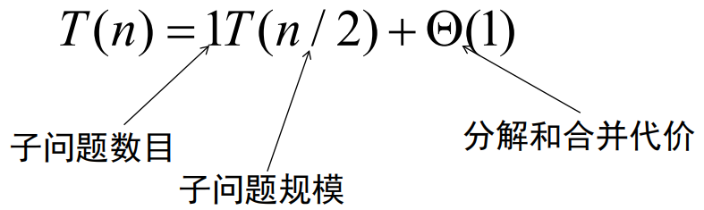
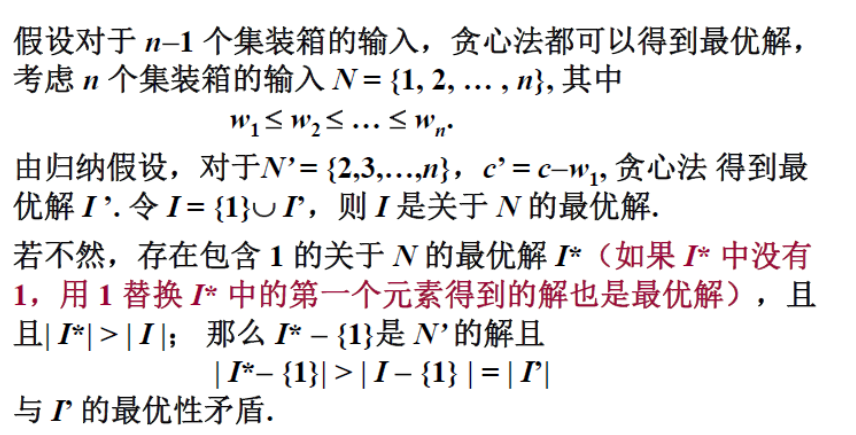
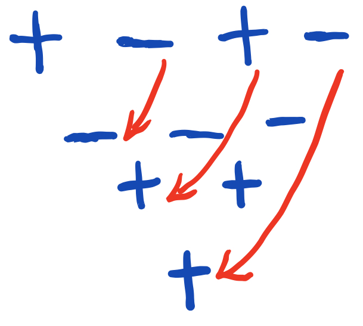
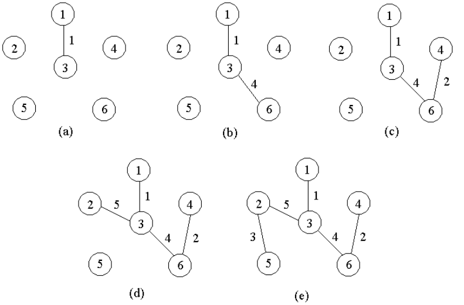
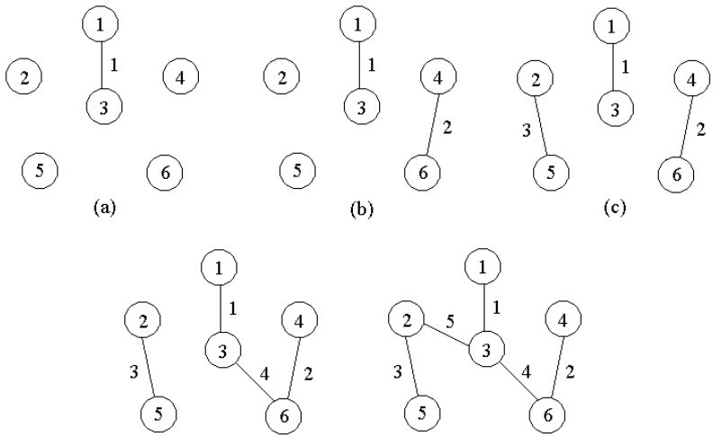
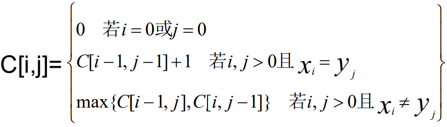
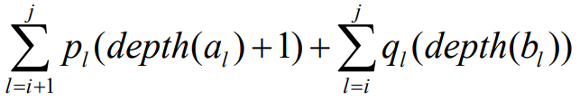
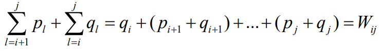
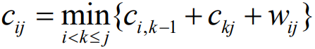
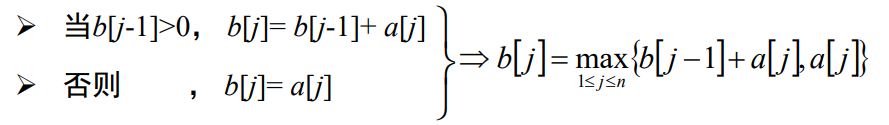

# 算法专业课

## 算法基本概念

- 算法的定义：若干条指令组成的有穷序列。满足五个性质：输入，输出，确定性，可行性，有穷性
- 算法的好坏如何衡量： 问题的规模，基本运算，算法的计算量函数（问题规模的某个函数）
- 描述算法时间复杂度：上界：O(f(n)) 下界：Ω(f(n)) 确界：θ(f(n))
- 如何评价算法：正确性，健壮性，简单性，高效性，最优性

## 递归与分治

- 什么是分治法：一个复杂的问题分成多个相对简单的独立问题进行求解，并且综合所有简单问题的解可以组成这个复杂问题的解。
- 分治法与平衡的概念：问题的规模大致相同 
- 分治与递归：
- 递归式的解法：代换法 递归树主定理 主方法三种情形
- 分治法的适用条件：问题具有最优子结构性质，子问题的解能够合并为原问题的解，问题的规模缩小到一定程度就可以容易解决，子问题相互独立。
- 分治法实例
  - 快速排序（主元，划分）
  - 最大元、最小元

  - 最近点对问题
  - 寻找顺序统计量问题（最大元，最小元的一般问题）

递归树：算高度时log底数要为子问题数目的倒数，分解成问题规模大小和分解和合并的代价。  T(n) = T(n/4) + T(n/2)+ n2  时间复杂度O（n^2）。

## 动态规划DP

- 动态规划方法的适用范围：子问题高度重复，问题满足最优子结构性质（一个问题的最优解包含子问题的最优解）。
  - 总体思想：保存已解决的子问题的答案，在需要时使 用，从而避免大量重复计算。
- 动态规划方法求解实例
  - 矩阵连乘问题 
  - LCS 
  - 最大子段和 
  - ……  

通常以自底向上的方式解各子问题，与分治法不同，分解所得的子问题很多都是重复的。

备忘录方法：二维数组中的元素很多在计算中用不到，只有在需要计算时才去计算，计算采用递归方式，值计算出来之后将其保存起来以备它用


最优化原理：

无后效性，只要背包剩余容量和可选物品一样，现阶段最优选择必定一样，不受之前选择的物品所影响。



## 贪心算法

-  贪心算法的基本思想：在一些列步骤中的每一步选择当前情况最优，但结果不一定是全局最优。通常以自顶向下的方式进行，以迭代的方式作出相继的贪心选择，每作一次贪心选择就将所求问题简化为规模更小的子问题。
- 贪心算法求解实例
  - 活动安排问题 
  - 单源最短路径 
  - 最小生成树


使用贪心的前提，一定存在一个以贪心选择开始的最优解，问题需要满足最优子结构性质。

**证明**

- 设箱子标号按照从轻到重记为1,2,…,n

- n = 1 贪心选择显然得到最优解

- 假设对规模n-1的输入得到最优解，证明对规模n的输入也得到最优解

  

## 随机算法

- 随机算法的分类：
  - las vegas  ：不一定有求得出解，但求得的解一定正确。（分析时间复杂度的期望值，和求不出解的概率）
  - monte carlo ：可能会出错。
  - Sherwood算法： las vegas的一种，总能求得解且一定正确。一个平均情况下较好的确定性算法，在最坏情况下效率不高。改为随机算法，使对任何输入在概率下都有很好的性能。
- 随机算法求解实例
  - 快速排序随机化版本 
  - 求第k小元素 
  - Testing String Equality 
  - Pattern Matching 
  - 主元素问题  

##  回溯法，分治限界法

- 回溯法与分枝限界法的基本概念 
  - 具有限界函数的深度优先生成法称为回溯法。
    - 常用约束函数剪去不满足**约束**的子树，用限界函数剪去得不到**最优解**的子树
  - 分枝限界法常以广度优先或以最小耗费优先的方式搜索问题的解空间树。
    - 队列式。
    - 优先队列式。
  
- 对于问题的一个实例，能够表示成一个n元式(x1,x2,…,xn)的形式满足显式约束条件的所有多元组，构成了该实例的一个解空间

- 回溯法求解时常见的两类解空间树 ：子集树和排列树。

  - 排列树：每一个节点可选可不选 时间复杂度O(2^n)
  - 排列树：选择某个结点 时间复杂度O(n!)

  > 解空间树中节点个数注意是相加。

- 求解实例 
  - 0-1背包
  - TSP
  - …… 

递归实现回溯法

```java
int a[n];
public static int backtrack(int i){
    if (i > n)
        输出结果;
    else {
        for (j = 下界; j <= 上界; j++) { // 枚举i所有可能的路径
            if (constranit(j) && bound(j)) { // 满足限界函数和约束条件
                a[i] = j;
                // 其他操作
                backtrack (i+1); //排列树需要在前后调用swap 调整输出顺序
                //回溯前的清理工作（如a[i]置空值等）;
            }
        }
    }
}
```

**迭代实现回溯法**


```java
int a[n],i;
初始化数组a[];
i = 1;
while (i>0(有路可走)   and  (未达到目标)){   // 还未回溯到头
    if(i > n) { // 搜索到叶结点 
          搜索到一个解，输出；
    } else {// 处理第i个元素 
         a[i]第一个可能的值；
         while(a[i]在不满足约束条件且在搜索空间内) {
              a[i]下一个可能的值；
         }
         if(a[i]在搜索空间内) {
              标识占用的资源；
              i = i+1;                              // 扩展下一个结点
         } else {
              清理所占的状态空间；            // 回溯
              i = i –1; 
         }
    }
}
```

**分支限界法**

```java
定义根节点t0为初始化扩展节点
根节点t0入队
while(队不空) {
	出队 --t;
	for (j = r0; j <= rn; ++j) {
		对 t 利用规则j发展新节点tj;
		if(限界函数判断tj可行可行) {
			若是目标解，找到结果，return
			否则进队 
		} 
	} 
}
```


## NP完全性

- 多项式时间(非严格分类)：n, nlogn, n
- 非多项式时间：O(2^n)

- 判定问题：只能回答是与否

- P、NP、NPC、NP Hard的定义及相互关系

  1. NP类问题是多项式时间可验证的，P类问题是多项式时间可解的。P=NP还是P真包含于NP，目前没人证明。

  2. NPC问题：所有NP问题在多项式时间内都能约化到它的NP问题，解决了NPC问题，所有NP问题也都能得到解决。

  3. NP hard问题：所有NP问题在多项式时间内都能约化(Reducibility)到它的问题(不一定是NP问题)。np难问题可以不是判定问题 。

  4. npc np难问题目前没有发现多项式时间的解法。

     

     > 证明一个问题B是NPC：证明B在多项式时间内可验证（是NP问题），并且找到一个已经知的NPC问题A可以在多项式时间内变化为(Karp规约)问题B，且A回答yes对应B也回答yes

- NPC问题实例

  1. 有向哈 密尔顿回路问题：有向图H有没有无重复遍历所有点的有向回路。
  2. 无向哈密尔顿回路问题：无向图G有没有无重复遍历所有点的回路。
  3. 图着色数：对图G，判断是否存在k染色，使相邻节点颜色相异。
  4. 0-1背包
  5. 最大团：判断图G中是否存在规模为K的团。在一个无向图中找出一个点数最多的完全图（每队顶点之间都有一条边）。
  5. 集合覆盖问题：选择最少的集合，覆盖全部的元素。不同集合覆盖元素不同，所有元素都有集合覆盖。    
  5. 顶点覆盖问题：给定一个N个点M条边的无向图G（点的编号从1至N），问是否存在一个不超过K个点的集合S，使得G中的每条边都至少有一个点在集合S中。（每条边都至少有一个点在里面）                                                                                                                                                                                                                                                                                                                                                               

旅行商问题求解最短路径为NPhard问题，求解是否存在小于某个值的路径为NPC问题


## 近似算法

- 近似算法的分类
  1. 常数近似比的近似方案
  2. 多项式时间近似方案
  3. 完全多项式时间近似方案
- 近似算法的性能
  - 最优化问题的最优值为`c*`，近似算法求得的最优值为c，则该近似算法的近似比为`max{c*/c, c/ c*}`，通常是一个问题输入规模的函数，`max{c*/c, c/ c*} ≤ ρ(n)`

## PROBLEM

---

### 活动安排问题

**贪心算法**

n个活动的集合E={1,2,…,n}，每个活动 i 在`[si ,fi )`时间内占用资源，选出最大的相容活动子集合

先按照结束时间按排序，从前到后检查，将相容的活动放进集合中，贪心体现在总是选择具有最早完成时间的相容活动，时间复杂度O(nlgn)。

贪心算法可以获得该问题的整体最优解 。可证明：

1. 活动安排问题有一个最优解以贪心选择开始；
2. 做出贪心选择之后，原问题简化为比原问题更小的但与原问题形式相同的子问题。

---

### 符号三角形

2个 同号下面都是“+”，2个异号下面都是“-”，对于给定的n，计算有多少个不同的符号三角形，使其所含的“+”和“-”的个数相同。



可行性约束函数：当前符号三角形所包含的“+”个数与“-”个数均不超过n*(n+1)/4 

> 计算可行性约束需要O(n)时间，在最坏情况下有O(2^n)个结点需要计算可行性约束，故解符号三角形问题的回溯算法所需的计算时间为O(n2^n)。

---

### 图的m着色问题

给定无向连通图G和m种不同的颜色。每个顶点着一种颜色。是否有一种着色法使G中每条边的2个顶点着不同颜色？

**回溯法：**

解空间树是一颗完全m叉树，结点个数是`∑( i=0~n-1) m^i` 最坏情况下，检查当前扩展结点的每一个儿子的颜色可用性为O(mn)，总时间复杂度为 O(nm^n)

机场停机位分配可以按照一个停机位为一个颜色，时间重叠的两个航班节点相连，用图着色问题处理

---

### 旅行商问题

**回溯法：**最坏情况下可能需要更新当前最优解O((n-1)!)次，每次更新bestx需计算时间O(n)，时间复杂度为O(n!).

解空间树：排列树

---

### 圆排列问题

n个大小不等的圆排进一个矩形框中，各圆与矩形框的底边相切，求最小长度的圆排列。

**回溯法：**最坏情况下要计算O(n!)次当前圆排列长度，每次计算需O(n)计算时间，整个算法的时间复杂性为O((n+1)!) 

---

### 装载问题(特殊的01背包)

**贪心法**

采用重量最轻者先装的贪心选择策略，可产生装载问题的最优解

**回溯法**

可行性约束条件（选择当前元素）：当前载重量小于装载总重量

上界函数（不选择当前元素）：当前载重量cw+剩余集装箱的重量r<=当前最优载重量bestw 

```java
if (cw + w[i] <= c) 
	//搜索左子树
if (cw + r > bestw) 
	//搜索右子树
```

**优先队列式分支限界法**

优先级定义为从根结点到结点x的路径所相应的载重量再加上剩余集装箱的重量之和，一旦有一个叶结点成为当前扩展结点，则可以断言该叶结点为最优解。


---

### 0-1背包问题

**贪心法**

可以用来求解背包问题（可以只装入物品的一部分），但不能是01背包。

计算每种物品单位重量价值，选择单位重量价值物品最高的物品装如背包。

**回溯法**

解空间：子集树

约束： 重量不大于背包

**优先队列式分支限界法**

优先级为已装袋的物品价值加上剩下的最大单位重量价值的物品装满剩余容量的价值和，当扩展到叶节点时为问题的最优值

---

### 批处理作业调度

n个作业的集合{J1,J2,…,Jn}。每个作业必须先由机器1处理，然后由机器2处理（不同作业时间不同），制定最佳作业调度方案，使其完成时间和达到最小。当机器数≥3时，流水作业 调度问题是一个NP-hard问题。

**动态规划方法**

流水调度作业中 Johnson不等式，让b大的先执行，a小的后执行min{ ai , aj , bi , bj }为ai 或者bj 时，先执行i

n个作业中首先开工（或最后开工）的作业确定之后，对剩下的n-1个作业采用相同方法可再确定其中的一个作业，作为n-1个作业中最先或最后执行的作业； 反复执行，即可确定最优调度，时间主要耗费在对任务集的排序，为O(nlgn)。

---

### n皇后问题

在n×n格的棋盘上放置彼此不受攻击的n个皇后。任何2个皇后不放在同一行或同一列或同一斜线上。

显约束：不同行，隐约束：不同列、对角线。

> 完全n叉树表示解空间，可行性约束剪去不满足行、列、斜 线约束的子树

---

### 找第k小元素

随机算法（Las Vegas算法）：随即找一个数x划分为大于等于和小于的三部分，看是否在k位置，若在则解为x，否则在对应范围内继续寻找。（注意x位置小于k，要找k-S1-S2小元素），若以等概率方法在n个数中随机取数，则该算法用到的比较数的期望值不超过4n。

---

### 单源最短路径问题

给定带权有向图G =(V,E)，其中每条边的权是非负实数，给定V中的一个顶点，称为源计算从源到所有其他各顶点的最短路长度。

**贪心法 Dijkstra算法**

设置顶点集合S，初始时，S中仅含有源，每次从V-S中取出具有最短特殊路长度（从源节点到目的节点中间只经过S）的顶点u，将u添加到S中，更新。n个顶点和e条边的带权有向图，如果用带权邻接矩阵表示这个图，时间复杂度为O(n^2)。

---

### 最小生成树问题

设G =(V,E)是无向连通带权图，生成树上各边权的总和为该生成树的耗费，求耗费最小的生成树。

**Prim算法**

S={1}  然后，只要S是V的真子集，就作如下的贪心选择： 选取满足条件i∈S，j∈V-S，且`c[i][j]`最小的边，将顶点j添加到S中，直到S=V时为止



记录V-S中每个节点到S最近的节点和距离，每次找出最近的顶点添加到s中，更新，时间复杂度O(n^2)

**Kurskal算法**



并查集的复杂度是阿克曼函数的反函数（增长非常快函数的反函数）可以认为是线性的，排序为mlogm，挑选n-1次边（最坏为O(m)），总复杂度为O(n+mlogm)

---

### LCS问题

找X，Y是两个序列的最长公共子序列Z。序列中元素之间可以不连续。

**动态规划法**

引入二维数组C记录Xi与Yj的LCS长度。

```c++
//计算最优值 0行需要全设为0
for(i:n){
    for(j:n){
        if (x[i]==y[j]) {
            c[i,j]=c[i-1,j-1]+1;
            b[i,j]="↖";
        } else {
            if (c[i-1,j]≥c[i,j-1]) { //找最长的值
                c[i,j]=c[i-1,j];
                b[i,j]="↑"; //找出所有LCS，需要记录两个方向
            } else {
                c[i,j]=c[i,j-1];
                b[i,j]="←";
            }
        }
    }
}


//构造最长公共子序列
if(b[i,j]="↖") {
    LCS(b,X,i-1,j-1);  
      print(x[i]); 
} else{
    if (b[i,j]="↑"){
        LCS(b,X,i-1,j)   
    } else {
        LCS(b,X,i,j-1);  
	} 
}
```

---

### 子集和问题

对于某个给定值M，如何从某个给定的正整数集合S中找个一个子集和s，使得该子集和为给定值M。如M=7，S={1,3,4,5}，则s={3,4}。

**动态规划法**

令subset(i,j)表示S中前i个元素的子集和等于j的情况，则

- 若S[i] > j，则S[i]不在子集s中。
- 若S[i] <= j, 则有以下两种情况：一种情况是S[i]不在子集s中，则subset(i, j) = subset(i-1, j); 一种情况是S[i]在子集s中，则subset(i, j)= subset(i-1, j-S[i]).

初始情况，j=0，都为true，否则 i=0 都为false。构建(n+1)*(m+1)真值表

### 最优二分搜索树

二分搜索树：左子树所有节点的值都小于根节点，右子树都大于根节点。左右子树都是二分搜索树。最优二分搜索树总耗费（查询成功的概率乘以深度加1求和加上查询失败的概率乘以深度）最小。树的耗费为：

**动态规划法**

一棵树接到另一个节点之下构成新树每个节点深度均增加1，耗费增加，最优子树的耗费为

---

### 最大字段和问题

n个整数序列a1 … an，求该序列 i~j  的子段和的最大值

**动态规划法**




15号考试：两个半小时

10道左右 ，可以用伪代码和自然语言处理