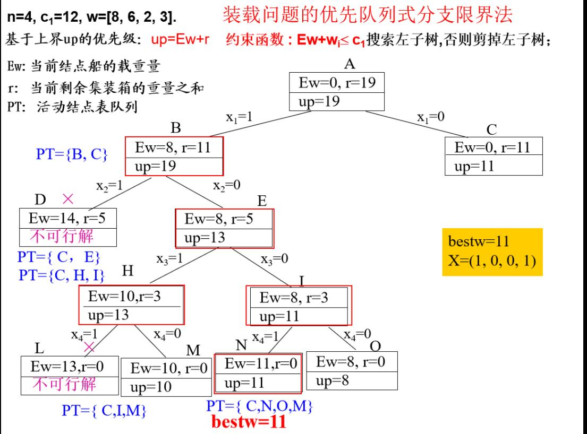
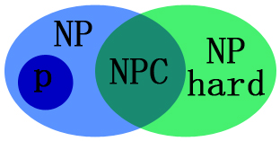
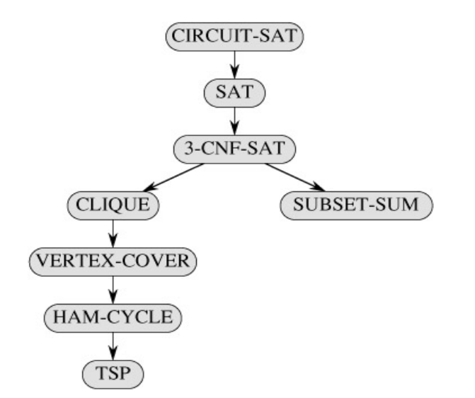

# 算法专业课


## 算法基本概念

算法的定义：若干条指令组成的有穷序列。满足五个性质：输入，输出，确定性，可行性，有穷性

算法的好坏如何衡量： 问题的规模，基本运算，算法的计算量函数

描述算法时间复杂度：O(f(n)) Ω(f(n)) θ(f(n))

如何评价算法：正确性，健壮性，简单性，高效性，最优性


## 递归与分治


什么是分治法：

分治法与平衡的概念：规模差不多 

分治与递归：

递归式的解	法：代换法 递归树主定理 主方法三种情形

递归树：算高度时log底数要为倒数，分解成问题规模大小和分解和合并的代价。  T(n) = T(n/4) + T(n/2)+ n2  时间复杂度O（n^2）

分治法的适用条件：子问题相互独立		

分治法实例

- 快速排序（主元，划分）
- 最大元、最小元

- 最近点对问题
- 寻找顺序统计量问题（最大元，最小元的一般问题， ）


## DP

动态规划方法的适用范围

动态规划方法求解实例

- 矩阵连乘问题 
- LCS 

- 最大子段和 
- ……  


流水调度作业中 Johnson不等式，让b大的先执行，a小的后执行

 min{ ai , aj , bi , bj }为ai 或者bj 时，先执行i


最优化原理：

无后效性，只要背包剩余容量和可选物品一样，现阶段最优选择必定一样，不受之前选择的物品所影响。


## 贪心

 贪心算法的基本思想：选择当前情况最优，不一定是全局最优。

 贪心算法求解实例

- 活动安排问题 
- 单源最短路径 

- 最小生成树  


一定存在一个以贪心选择开始的最优解，

满足最优子结构性质。


## 随机

随机算法的分类：lesvegas  ：不一定有解，求得的解一定正确。monte carlo ：可能会出错，Sherwood： lesvegas的一种

Las Vegas和Monte Carlo算法的区别 

Sherwood算法

随机算法求解实例

- 快速排序随机化版本 
- 求第k小元素 

- Testing String Equality 
- Pattern Matching 

- 主元素问题  


##  回溯法，分治限界法

- 回溯法与分枝限界法的基本概念 
- 回溯法求解时常见的两类解空间树 ：子集树和排列树
- 求解实例 
  - 0-1背包 
  - TSP 
  - ……  

递归法 算法框架

```java
int a[n];
public static int backtrack(int i){
    if (i > n)
        输出结果;
    else {
        for (j = 下界; j <= 上界; j++) { // 枚举i所有可能的路径
            if (constranit(j) && bound(j)) { // 满足限界函数和约束条件
                a[i] = j;
                // 其他操作
                backtrack (i+1);
                //回溯前的清理工作（如a[i]置空值等）;
            }
        }
    }
}
```

```java
int a[n],i;
初始化数组a[];
i = 1;
while (i>0(有路可走)   and  (未达到目标)){   // 还未回溯到头
    if(i > n) { // 搜索到叶结点 
          搜索到一个解，输出；
    } else {// 处理第i个元素 
         a[i]第一个可能的值；
         while(a[i]在不满足约束条件且在搜索空间内) {
              a[i]下一个可能的值；
         }
         if(a[i]在搜索空间内) {
              标识占用的资源；
              i = i+1;                              // 扩展下一个结点
         } else {
              清理所占的状态空间；            // 回溯
              i = i –1; 
         }
    }
}
```





## NP完全性

- 多项式时间(非严格分类)：n, nlogn, n
- 非多项式时间：O(2^n)

- 判定问题：只能回答是与否

- P、NP、NPC、NP Hard的定义及相互关系

  1. NP类问题是多项式时间可验证的，P类问题是多项式时间可解的。P=NP还是P真包含于NP，目前没人证明。

  2. NPC问题：所有NP问题在多项式时间内都能约化到它的NP问题，解决了NPC问题，所有NP问题也都能得到解决。

  3. NP hard问题：所有NP问题在多项式时间内都能约化(Reducibility)到它的问题(不一定是NP问题)。np难问题可以不是判定问题 。

  4. npc np难问题目前没有发现多项式时间的解法。

     

     > 证明一个问题是BNPC：证明B在多项式时间内可验证（是NP问题），并且找到一个已经知的NPC问题A可以在多项式时间内变化为(Karp规约)问题B

- NPC问题实例  

  1. 有向哈密尔顿回路问题：有向图H有没有无重复遍历所有点的有向回路。
  2. 无向哈密尔顿回路问题：无向图G有没有无重复遍历所有点的回路。
  3. 图着色数：对图G，判断是否存在k染色，使相邻节点颜色相异。
  4. 0-1背包
  5. 最大团：判断图G中是否存在规模为K的团。在一个无向图中找出一个点数最多的完全图。

旅行商问题求解最短路径为NPhard问题，求解是否存在小于某个值的路径为NPC问题



## 近似算法

- 近似算法的分类
  1. 常数近似比的近似方案
  2. 多项式时间近似方案
  3. 完全多项式时间近似方案
- 近似算法的性能
  - 最优化问题的最优值为`c*`，近似算法求得的最优值为c，则该近似算法的近似比为`max{c*/c, c/ c*}`，通常是一个问题输入规模的函数，`max{c*/c, c/ c*} ≤ ρ(n)`


 


15号考试：两个半小时

10道左右 ，可以用伪代码和自然语言处理