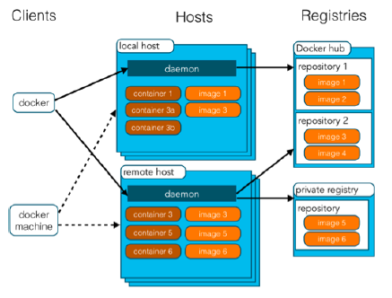
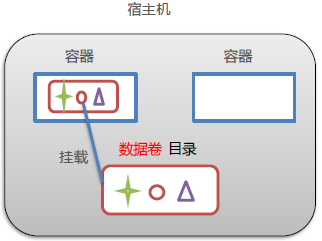
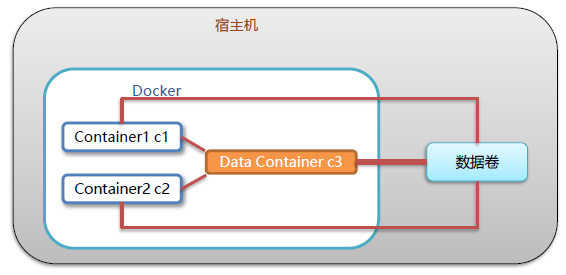
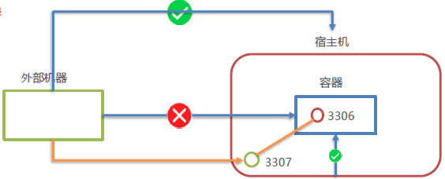
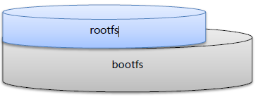
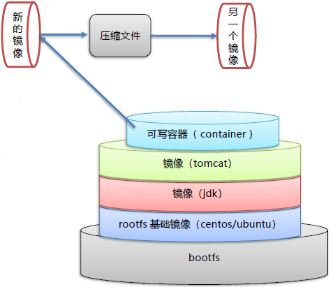
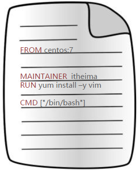
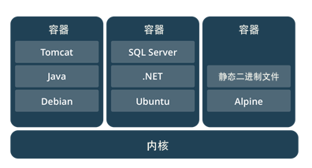
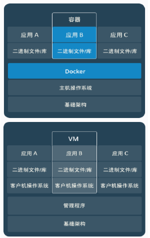

### 初识 Docker

#### docker 概念

我们写的代码会接触到好几个环境：开发环境、测试环境以及生产环境：(软件跨环境迁移的问题)

- Docker 是一个开源的应用容器引擎
- 诞生于 2013 年初，基于 Go 语言实现， dotCloud 公司出品（后改名为 Docker Inc）
- Docker 可以让开发者打包他们的应用以及依赖包到一个轻量级、可移植的容器中，然后发布到任何流行的Linux 机器上。
- 容器是完全使用沙箱机制，相互隔离
- 容器性能开销极低。
- Docker 从 17.03 版本之后分为 CE Community Edition: 社区版） 和 EE Enterprise Edition: 企业版）

#### 安装 docker

Docker可以运行在 MAC 、 Windows 、 CentOS 、 UBUNTU 等操作系统上，本课程基于 CentOS 7 安装
Docker 。官网： https://www.docker.com

```shell
# 1、yum 包更新到最新 
yum update
# 2、安装需要的软件包， yum-util 提供yum-config-manager功能，另外两个是devicemapper驱动依赖的 
yum install -y yum-utils device-mapper-persistent-data lvm2
# 3、 设置yum源
yum-config-manager --add-repo https://download.docker.com/linux/centos/docker-ce.repo
# 4、 安装docker，出现输入的界面都按 y 
yum install -y docker-ce
# 5、 查看docker版本，验证是否验证成功
docker -v
```

#### docker 架构

- 镜像（ Image Docker）镜像（ Image ），就相当于是一个 root 文件系统。比如官方镜像 ubuntu:16.04 就包含了完整的一套 Ubuntu16.04 最小系统的 root 文件系统。
- 容器（ Container ）：镜像 （Image ）和容器 （Container ）的关系，就像是面向对象程序设计中的类和对象一样，镜像是静态的定义，容器是镜像运行时的实体。容器可以被创建、启动、停止、删除、暂停等。
- 仓库（ Repository ）：仓库可看成一个代码控制中心用来保存镜像。



**配置Docker 镜像加速器**

默认情况下，将来从docker hub https://hub.docker.com/ com/）上下载docker 镜像，太慢。一般都会配置镜像加速器：

- USTC ：中科大镜像加速器 https://docker.mirrors.ustc.edu.cn
- 阿里云(每个用户有各自的)
- 网易云
- 腾讯云

### Docker 命令

#### 进程相关命令

- 启动 docker 服务

  ```shell
  systemctl start docker
  ```

- 停止 docker 服务

  ```shell
  systemctl stop docker
  ```

- 重启 docker 服务

  ```shell
  systemctl restart docker
  ```

- 查看 docker 服务状态

  ```shell
  systemctl status docker
  ```

- 开机启动 docker 服务

  ```shell
  systemctl enable docker
  ```

#### 镜像相关命令

- 查看镜像: 查看本地所有的镜像

  ```shell
  docker images
  docker images -q # 查看所用镜像的 id
  ```

- 搜索镜像: 从网络中查找需要的镜像

  ```shell
  docker search 镜像名称
  ```

- 拉取镜像: 从 Docker 仓库下载镜像到本地，镜像名称格式为 名称 版本号，如果版本号不指定则是最新的版本。如果不知道镜像版本，可以去docker hub 搜索对应镜像查看。

  ```shell
  docker pull 镜像名称 # 默认版本
  docker pull redis:5.0 # 下载5.0版本的redis
  ```

- 删除镜像

  ```shell
  docker rmi 镜像id # 删除指定本地镜像
  docker rmi 镜像名称:版本 #删除指定的本地镜像
  docker rmi `docker images -q` # 删除所有本地镜像
  ```

#### 容器相关命令

- 查看容器

  ```shell
  docker ps #查看正在运行的容器
  docker ps -a # 查看所有容器
  ```

- 创建并启动容器进入容器

  ```shell
  docker run 参数
  docker run -it --name=c1 centos:7 /bin/bash # 等号也可以换成空格 最后是进入容器的初始化指令
  docker run -id --name=c2 centos:7 
  ```

  - 参数说明：
    - i ：保持容器运行。通常与 t 同时使用。加入 it 这两个参数后，容器创建后自动进入容器中，退出容器后，容器自动关闭。
    - t ：为容器重新分配一个伪输入终端，通常与 i 同时使用。
    - d ：以守护（后台）模式运行容器。创建一个容器在后台运行，需要使用 docker exec 进入容器。退出后，容器不会关闭。
    - it 创建的容器一般称为交互式容器， id 创建的容器一般称为守护式容器
    - name ：为创建的容器命名。

- 进入容器

  ```shell
  docker exec 参数 # 退出容器，容器不会关闭
  docker exec -it c2 /bin/bash # 进入c2容器
  exit # 退出容器
  ```

- 停止容器

  ```shell
  docker stop 容器名称
  ```

- 启动容器

  ```shell
  docker start 容器名称
  ```

- 删除容器：如果容器是运行状态则删除失败，需要停止容器才能删除

  ```shell
  docker rm 容器名称
  docker rm `docker ps -aq` # 删除所有容器
  ```

- 查看容器信息

  ```shell
  docker inspect 容器名称
  ```

### Docker 容器数据卷

#### 数据卷概念及作用

思考：

- Docker 容器删除后，在容器中产生的数据还在吗？
- Docker 容器和外部机器可以直接交换文件吗？
- 容器之间想要进行数据交互？

**数据卷**

- 
  数据卷是宿主机中的一个目录或文件
- 当容器目录和数据卷目录绑定后，对方的修改会立即同步
- 一个数据卷可以被多个容器同时挂载
- 一个容器也可以被挂载多个数据卷

**数据卷作用**

- 容器数据持久化
- 外部机器和容器间接通信
- 容器之间数据交换



#### 配置数据卷

- 创建启动容器时，使用 v 参数 设置数据卷

  ```shell
  docker run ... -v 宿主机目录(文件):容器内目录(文件) ...
  docker run -it --name=c1 -v /root/data:/root/data_container centos:7 /bin/bash
  # 多个-v参数挂载多个目录
  ```

- 注意事项：

  - 目录必须是绝对路径
  - 如果目录不存在，会自动创建
  - 可以挂载多个数据卷

**数据卷容器**

多容器进行数据交换

1. 多个容器挂载同一个数据卷

2. 数据卷容器



#### 配置数据卷容器

1. 创建启动 c3 数据卷容器，使用 v 参数 设置数据卷

   ```shell
   docker run -it --name=c3 -v /volume centos:7 /bin/bash # 左边的目录如果省略会自动分配
   ```

2. 创建启动 c1 c2 容器，使用 volumes from 参数 设置数据卷

   ```shell
   docker run -it --name=c1 --volumes-from c3 centos:7 /bin/bash
   docker run -it --name=c2 --volumes-from c3 centos:7 /bin/bash
   ```

### Docker 应用部署

#### MySQL 部署

**案例：需求**

在Docker 容器中部署 MySQL ，并通过外部 mysql 客户端操作 MySQL Server

**案例：实现步骤**

①搜索 mysql 镜像

②拉取 mysql 镜像

③创建容器

④操作容器中的 mysql

- 容器内的网络服务和外部机器不能直接通信
- 外部机器和宿主机可以直接通信
- 宿主机和容器可以直接通信
- 当容器中的网络服务需要被外部机器访问时，可以将容器中提供服务的端口映射到宿主机的端口上。外部机器访问宿主机的该端口，从而间接访问容器的服务。
- 这种操作称为： 端口映射



1. 搜索mysql镜像

```shell
docker search mysql
```

2. 拉取mysql镜像

```shell
docker pull mysql:5.6
```

3. 创建容器，设置端口映射、目录映射

```shell
# 在/root目录下创建mysql目录用于存储mysql数据信息
mkdir ~/mysql
cd ~/mysql
```

```shell
docker run -id \
-p 3307:3306 \	#一般容器和宿主机都是3306 相同
--name=c_mysql \
-v $PWD/conf:/etc/mysql/conf.d \
-v $PWD/logs:/logs \
-v $PWD/data:/var/lib/mysql \
-e MYSQL_ROOT_PASSWORD=123456 \
mysql:5.6
```

- 参数说明：
  - **-p 3307:3306**：将容器的 3306 端口映射到宿主机的 3307 端口。
  - **-v $PWD/conf:/etc/mysql/conf.d**：将主机当前目录下的 conf/my.cnf 挂载到容器的 /etc/mysql/my.cnf。配置目录
  - **-v $PWD/logs:/logs**：将主机当前目录下的 logs 目录挂载到容器的 /logs。日志目录
  - **-v $PWD/data:/var/lib/mysql** ：将主机当前目录下的data目录挂载到容器的 /var/lib/mysql 。数据目录
  - **-e MYSQL_ROOT_PASSWORD=123456：**初始化 root 用户的密码。

4. 进入容器，操作mysql

```shell
docker exec –it c_mysql /bin/bash
mysql -uroot -p123456	# 登录mysql
```

5. 使用外部机器连接容器中的mysql


#### Tomcat 部署

**案例：需求**

在Docker 容器中部署 Tomcat ，并通过外部机器访问 Tomcat 部署的项目。

**案例：实现步骤**

①搜索 tomcat 镜像

②拉取 tomcat 镜像

③创建容器

④部署项目

⑤测试访问

1. 搜索tomcat镜像

```shell
docker search tomcat
```

2. 拉取tomcat镜像

```shell
docker pull tomcat
```

3. 创建容器，设置端口映射、目录映射

```shell
# 在/root目录下创建tomcat目录用于存储tomcat数据信息
mkdir ~/tomcat
cd ~/tomcat
```

```shell
docker run -id --name=c_tomcat \
-p 8080:8080 \
-v $PWD:/usr/local/tomcat/webapps \
tomcat 
```

- 参数说明：
  - **-p 8080:8080：**将容器的8080端口映射到主机的8080端口
  
    **-v $PWD:/usr/local/tomcat/webapps：**将主机中当前目录挂载到容器的webapps

4. 使用外部机器访问tomcat


#### Nginx 部署

**案例：需求**

在Docker 容器中部署 Nginx ，并通过外部机器访问 Nginx 。

**案例：实现步骤**

①搜索 Nginx 镜像

②拉取 Nginx 镜像

③创建容器

④测试访问

1. 搜索nginx镜像

```shell
docker search nginx
```

2. 拉取nginx镜像

```shell
docker pull nginx
```

3. 创建容器，设置端口映射、目录映射


```shell
# 在/root目录下创建nginx目录用于存储nginx数据信息
mkdir ~/nginx
cd ~/nginx
mkdir conf
cd conf
# 在~/nginx/conf/下创建nginx.conf文件,粘贴下面内容 官方提供的
vim nginx.conf
```
```shell
user  nginx;
worker_processes  1;

error_log  /var/log/nginx/error.log warn;
pid        /var/run/nginx.pid;


events {
    worker_connections  1024;
}


http {
    include       /etc/nginx/mime.types;
    default_type  application/octet-stream;

    log_format  main  '$remote_addr - $remote_user [$time_local] "$request" '
                      '$status $body_bytes_sent "$http_referer" '
                      '"$http_user_agent" "$http_x_forwarded_for"';

    access_log  /var/log/nginx/access.log  main;

    sendfile        on;
    #tcp_nopush     on;

    keepalive_timeout  65;

    #gzip  on;

    include /etc/nginx/conf.d/*.conf;
}
```


```shell
docker run -id --name=c_nginx \
-p 80:80 \
-v $PWD/conf/nginx.conf:/etc/nginx/nginx.conf \	# 该文件要提前准备好
-v $PWD/logs:/var/log/nginx \
-v $PWD/html:/usr/share/nginx/html \
nginx
```

- 参数说明：
  - **-p 80:80**：将容器的 80端口映射到宿主机的 80 端口。
  - **-v $PWD/conf/nginx.conf:/etc/nginx/nginx.conf**：将主机当前目录下的 /conf/nginx.conf 挂载到容器的 :/etc/nginx/nginx.conf。配置目录
  - **-v $PWD/logs:/var/log/nginx**：将主机当前目录下的 logs 目录挂载到容器的/var/log/nginx。日志目录

4. 使用外部机器访问nginx


#### Redis 部署

**案例：需求**

在Docker 容器中部署 Redis ，并通过外部机器访问 Redis 。

**案例：实现步骤**

①搜索 Redis 镜像

②拉取 Redis 镜像

③创建容器

④测试访问


1. 搜索redis镜像

```shell
docker search redis
```

2. 拉取redis镜像

```shell
docker pull redis:5.0
```

3. 创建容器，设置端口映射

```shell
docker run -id --name=c_redis -p 6379:6379 redis:5.0
```

4. 使用外部机器连接redis

```shell
./redis-cli.exe -h 192.168.149.135 -p 6379
```


### Dockerfile

#### Docker 镜像原理

思考：

- Docker 镜像本质是什么？
- Docker 中一个 centos 镜像为什么只有 200MB ，而一个centos 操作系统的 iso 文件要几个个 G
- Docker 中一个 tomcat 镜像为什么有 500MB ，而一个tomcat 安装包只有 70 多 MB

操作系统组成部分：

- 进程调度子系统
- 进程通信子系统
- 内存管理子系统
- 设备管理子系统
- 文件管理子系统
- 网络通信子系统
- 作业控制子系统

Linux文件系统由 bootfs 和 rootfs 两部分组成

- bootfs ：包含 bootloader （引导加载程序）和 kernel （内核）
- rootfs：root 文件系统， 包含的就是典型 Linux 系统中的 /dev，/proc ，/bin ，/etc 等标准目录和文件
- 不同的 linux 发行版， bootfs 基本一样，而 rootfs 不同，如 ubuntu，centos 等



- Docker 镜像是由特殊的文件系统叠加而成
- 最底端是 bootfs ，并使用宿主机的 bootfs
- 第二层是 root 文件系统 rootfs, 称为 base image
- 然后再往上可以叠加其他的镜像文件
- 统一文件系统（ Union File System ）技术能够将不同的层整合成一个文件系统，为这些层提供了一个统一的视角，这样就隐藏了多层的存在，在用户的角度看来，只存在一个文件系统。
- 一个镜像可以放在另一个镜像的上面。位于下面的镜像称为父镜像，最底部的镜像成为基础镜像。
- 当从一个镜像启动容器时， Docker 会在最顶层加载一个读写文件系统作为容器


思考：

1. Docker 镜像本质是什么？
   1. 是一个分层文件系统

2. Docker 中一个 centos 镜像为什么只有 200MB ，而一个 centos 操作系统的 iso 文件要几个个 G
   1. Centos 的 iso 镜像文件包含 bootfs 和 rootfs ，而 docker 的 centos 镜像复用操作系统的 bootfs ，只有 rootfs 和其他镜像层

3. Docker 中一个 tomcat 镜像为什么有 500MB ，而一个 tomcat 安装包只有 70 多 MB
   1. 由于 docker 中镜像是分层的， tomcat 虽然只有 70 多 MB ，但他需要依赖于父镜像和基础镜像，所有整个对外暴露的tomcat 镜像大小 500 多 MB

**镜像制作**

Docker镜像如何制作？

1. 容器转为镜像

   ```shell
   docker commit 容器id 镜像名称:版本号	# id可以只输入部分，只要能识别即可 
   #目录挂载内容不会被写入镜像
   docker save o 压缩文件名称 镜像名称:版本号
   docker load i 压缩文件名称
   ```

2. dockerfile




#### Dockerfile 概念及作用

Dockerfile概念

- Dockerfile 是一个文本文件
- 包含了一条条的指令
- 每一条指令构建一层，基于基础镜像，最终构建出一个新的镜像
- 对于开发人员：可以为开发团队提供一个完全一致的开发环境
- 对于测试人员：可以直接拿开发时所构建的镜像或者通过 Dockerfile 文件构建一个新的镜像开始工作了
- 对于运维人员：在部署时，可以实现应用的无缝移植



Dochub网址： https://hub.docker.com

#### Dockerfile 关键字

| 关键字      | 作用                     | 备注                                                         |
| ----------- | ------------------------ | ------------------------------------------------------------ |
| FROM        | 指定父镜像               | 指定dockerfile基于那个image构建                              |
| MAINTAINER  | 作者信息                 | 用来标明这个dockerfile谁写的                                 |
| LABEL       | 标签                     | 用来标明dockerfile的标签 可以使用Label代替Maintainer 最终都是在docker image基本信息中可以查看 |
| RUN         | 执行命令                 | 执行一段命令 默认是/bin/sh 格式: RUN command 或者 RUN ["command" , "param1","param2"] |
| CMD         | 容器启动命令             | 提供启动容器时候的默认命令 和ENTRYPOINT配合使用.格式 CMD command param1 param2 或者 CMD ["command" , "param1","param2"] |
| ENTRYPOINT  | 入口                     | 一般在制作一些执行就关闭的容器中会使用                       |
| COPY        | 复制文件                 | build的时候复制文件到image中                                 |
| ADD         | 添加文件                 | build的时候添加文件到image中 不仅仅局限于当前build上下文 可以来源于远程服务 |
| ENV         | 环境变量                 | 指定build时候的环境变量 可以在启动的容器的时候 通过-e覆盖 格式ENV name=value |
| ARG         | 构建参数                 | 构建参数 只在构建的时候使用的参数 如果有ENV 那么ENV的相同名字的值始终覆盖arg的参数 |
| VOLUME      | 定义外部可以挂载的数据卷 | 指定build的image那些目录可以启动的时候挂载到文件系统中 启动容器的时候使用 -v 绑定 格式 VOLUME ["目录"] |
| EXPOSE      | 暴露端口                 | 定义容器运行的时候监听的端口 启动容器的使用-p来绑定暴露端口 格式: EXPOSE 8080 或者 EXPOSE 8080/udp |
| WORKDIR     | 工作目录                 | 指定容器内部的工作目录 如果没有创建则自动创建 如果指定/ 使用的是绝对地址 如果不是/开头那么是在上一条workdir的路径的相对路径 |
| USER        | 指定执行用户             | 指定build或者启动的时候 用户 在RUN CMD ENTRYPONT执行的时候的用户 |
| HEALTHCHECK | 健康检查                 | 指定监测当前容器的健康监测的命令 基本上没用 因为很多时候 应用本身有健康监测机制 |
| ONBUILD     | 触发器                   | 当存在ONBUILD关键字的镜像作为基础镜像的时候 当执行FROM完成之后 会执行 ONBUILD的命令 但是不影响当前镜像 用处也不怎么大 |
| STOPSIGNAL  | 发送信号量到宿主机       | 该STOPSIGNAL指令设置将发送到容器的系统调用信号以退出。       |
| SHELL       | 指定执行脚本的shell      | 指定RUN CMD ENTRYPOINT 执行命令的时候 使用的shell            |

#### 案例

**案例：需求**

自定义centos7 镜像。要求：

1. 默认登录路径为 /usr

2. 可以使用 vim

**案例：实现步骤**

①定义父镜像：`FROM centos:7`

②定义作者信息： `MAINTAINER itheima <itheima@126.com>`

③执行安装 vim 命令： `RUN yum install -y vim`

④定义默认的工作目录：` WORKDIR /usr`

⑤定义容器启动执行的命令： `CMD /bin/bash`

⑥通过 dockerfile 构建镜像： `docker bulid -f dockerfile文件路径 -t 镜像名称:版本 .`(版本省略则是latest)

**案例：需求**

定义dockerfile ，发布 springboot 项目

**案例：实现步骤**

①定义父镜像： `FROM java:8`

②定义作者信息： `MAINTAINER itheima <itheima@126.com>`

③将 jar 包添加到容器： `ADD springboot.jar app.jar`

④定义容器启动执行的命令： `CMD java -jar app.jar`

⑤通过 dockerfile 构建镜像： `docker bulid -f dockerfile文件路径 -t 镜像名称:版本 .` (1-4为dockerfile内容)

### Docker 服务编排

#### 服务编排概念

微服务架构的应用系统中一般包含若干个微服务，每个微服务一般都会部署多个实例，如果每个微服务都要手动启停，维护的工作量会很大。

- 要从 `Dockerfile build image` 或者去 dockerhub 拉取 image
- 要创建多个 container
- 要管理这些 container （启动停止删除）

服务编排：按照一定的业务规则批量管理容器

#### Docker Compose 概述

Docker Compose是一个编排多容器分布式部署的工具，提供命令集管理容器化应用的完整开发周期，包括服务构建，启动和停止。使用步骤：

1. 利用 Dockerfile 定义运行环境镜像

2. 使用 docker-compose.yml 定义组成应用的各服务

3. 运行 docker-compose up 启动应用


**Docker Compose安装使用**

一、安装Docker Compose

```shell
# Compose目前已经完全支持Linux、Mac OS和Windows，在我们安装Compose之前，需要先安装Docker。下面我 们以编译好的二进制包方式安装在Linux系统中。 
curl -L https://github.com/docker/compose/releases/download/1.22.0/docker-compose-`uname -s`-`uname -m` -o /usr/local/bin/docker-compose
# 设置文件可执行权限 
chmod +x /usr/local/bin/docker-compose
# 查看版本信息 
docker-compose -version
```

**二、卸载Docker Compose**

```shell
# 二进制包方式安装的，删除二进制文件即可
rm /usr/local/bin/docker-compose
```

**三、 使用docker compose编nginx+springboot项目**

1. 创建docker-compose目录

```shell
mkdir ~/docker-compose
cd ~/docker-compose
```

2. 编写 docker-compose.yml 文件

```shell
version: '3'
services:
  nginx:
   image: nginx
   ports:
    - 80:80
   links:
    - app
   volumes:
    - ./nginx/conf.d:/etc/nginx/conf.d
  app:
    image: app
    expose:
      - "8080"
```

3. 创建./nginx/conf.d目录

```shell
mkdir -p ./nginx/conf.d
```

4. 在./nginx/conf.d目录下 编写itheima.conf文件

```shell
server {
    listen 80;
    access_log off;

    location / {
        proxy_pass http://app:8080;
    }
   
}
```

5. 在~/docker-compose 目录下 使用docker-compose 启动容器

```shell
docker-compose up
```

6. 测试访问

```shell
http://192.168.149.135/hello
```

### Docker 私有仓库

#### 搭建私有仓库

Docker官方的 Docker hub https://hub.docker.com ）是一个用于管理公共镜像的仓库，我们可以从上面拉取镜像到本地，也可以把我们自己的镜像推送上去。但是，有时候我们的服务器无法访问互联网，或者你不希望将自己的镜像放到公网当中，那么我们就需要搭建自己的私有仓库来存储和管理自己的镜像。

```shell
# 1、拉取私有仓库镜像 
docker pull registry
# 2、启动私有仓库容器 
docker run -id --name=registry -p 5000:5000 registry
# 3、打开浏览器 输入地址http://私有仓库服务器ip:5000/v2/_catalog，看到{"repositories":[]} 表示私有仓库 搭建成功
# 4、修改daemon.json   
vim /etc/docker/daemon.json    
# 在上述文件中添加一个key，用逗号分割，保存退出。此步用于让 docker 信任私有仓库地址；注意将私有仓库服务器ip修改为自己私有仓库服务器真实ip 
{"insecure-registries":["私有仓库服务器ip:5000"]} 
# 5、重启docker 服务 
systemctl restart docker
docker start registry
```

#### 上传镜像到私有仓库

```shell
# 1、标记镜像为私有仓库的镜像     
docker tag centos:7 私有仓库服务器IP:5000/centos:7
 
# 2、上传标记的镜像     
docker push 私有仓库服务器IP:5000/centos:7
```

#### 从私有仓库拉取镜像

```shell
#拉取镜像 
docker pull 私有仓库服务器ip:5000/centos:7
```

### Docker 相关概念

#### docker 容器虚拟化 与 传统虚拟机比较

容器就是将软件打包成标准化单元，以用于开发、交付和部署。

- 容器镜像是轻量的、可执行的独立软件包 ，包含软件运行所需的所有内容：代码、运行时环境、系统工具、系统库和设置。
- 容器化软件在任何环境中都能够始终如一地运行。
- 容器赋予了软件独立性，使其免受外在环境差异的影响，从而有助于减少团队间在相同基础设施上运行不同软件时的冲突。



相同：

- 容器和虚拟机具有相似的资源隔离和分配优势

不同：

- 容器虚拟化的是操作系统，虚拟机虚拟化的是硬件。
- 传统虚拟机可以运行不同的操作系统，容器只能运行同一类型操作系统

| 特性       | 容器               | 虚拟机     |
| ---------- | ------------------ | ---------- |
| 启动       | 秒级               | 分钟级     |
| 硬盘使用   | 一般为MB           | 一般为GB   |
| 性能       | 接近原生           | 弱于       |
| 系统支持量 | 单机支持上千个容器 | 一般几十个 |

