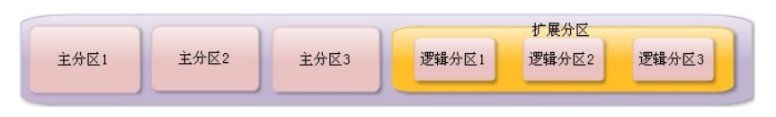

# 9. 文件管理系统


## 9.1 回顾分区和文件系统

### 1、分区类型 

- 主分区：总共最多只能分四个
- 扩展分区：只能有一个，也算作主分区的一种 ，也就是说主分区加扩展分区最多有四个。但 是扩展分区不能存储数据和格式化，必须再划 分成逻辑分区才能使用。
- 逻辑分区：逻辑分区是在扩展分区中划分的， 如果是IDE硬盘，Linux最多支持59个逻辑分区 ，如果是SCSI硬盘Linux最多支持11个逻辑分区

### 2、分区表示方法



|   分区    | 名称（sd 表示sata硬盘接口 a表示第几块硬盘 ） |
| :-------: | -------------------------------------------- |
|  主分区1  | /dev/sda1                                    |
|  主分区2  | /dev/sda2                                    |
|  主分区3  | /dev/sda3                                    |
| 扩展分区  | /dev/sda4                                    |
| 逻辑分区1 | /dev/sda5                                    |
| 逻辑分区2 | /dev/sda6                                    |
| 逻辑分区3 | /dev/sda7                                    |

### 2、文件系统

- ext2：是ext文件系统的升级版本，Red Hat Linux7.2版本以前的系统默认都是ext2 文件系统。1993年发布，最大支持16TB 的分区和最大2TB的文件（ 1TB=1024GB=1024*1024KB）
- ext3： ext3文件系统是ext2文件系统的升级版本，最大的区别就是带日志功能，以 在系统突然停止时提高文件系统的可靠性 。支持最大16TB的分区和最大2TB的文件
- ext4：它是ext3文件系统的升级版。ext4 在性能 、伸缩性和可靠性方面进行了大量改进。EXT4 的变化可以说是翻天覆地的，比如向下兼容 EXT3、最大1EB文件系统和16TB文件、无限数 量子目录、Extents连续数据块概念、多块分配 、延迟分配、持久预分配、快速FSCK、日志校 验、无日志模式、在线碎片整理、inode增强、 默认启用barrier等。是CentOS 6.3的默认文件系 统 （1EB=1024PB=1024*1024TB）

## 9.2 文件系统常用命令 

### 9.2.1 df命令、du命令、fsck命令和dump2fs命令 

1、文件系统查看命令df 统计文件系统的占用情况

```shell

[root@localhost ~]# df [选项] [挂载点]
选项：
-a 显示所有的文件系统信息，包括特殊文件系统，如
/proc、/sysfs
-h 使用习惯单位显示容量，如KB，MB或GB等
-T 显示文件系统类型
-m 以MB为单位显示容量
-k 以KB为单位显示容量。默认就是以KB为单位
```

2、统计目录或文件大小

```shell
[root@localhost ~]# du [选项] [目录或文件名]
选项：
-a 显示每个子文件的磁盘占用量。默认只统计
子目录的磁盘占用量
-h 使用习惯单位显示磁盘占用量，如KB，MB
或GB等
-s 统计总占用量，而不列出子目录和子文件的
占用量
```

ls不显示目录下数据的大小？？

du命令和df命令的区别

- df命令是从文件系统考虑的，不光要考虑文件占用的空间，还要统计被命令或程序占用的空间（最常见的就是文件已经删除 ，但是程序并没有释放空间） 
- du命令是面向文件的，只会计算文件或目录占用的空间

3、文件系统修复命令fsck 

```shell
[root@localhost ~]# fsck [选项] 分区设备文件名
选项：
-a：不用显示用户提示，自动修复文件系统
-y：自动修复。和-a作用一致，不过有些文件系统只支
持-y
```

4、显示磁盘状态命令dumpe2fs

```shell
 [root@localhost ~]# dumpe2fs 分区设备文件名
```

### 9.2.2 挂载命令 

1、查询与自动挂载

```shell
 [root@localhost ~]# mount [-l] 
 #查询系统中已经挂载的设备，-l会显示卷标名称 
 [root@localhost ~]# mount –a 
 #依据配置文件/etc/fstab的内容，自动挂载
```

2、挂载命令格式

```shell
[root@localhost ~]# mount [-t 文件系统] [-L 卷标名] \
[-o 特殊选项] 设备文件名 挂载点
选项：
-t 文件系统：加入文件系统类型来指定挂载的类型，可
以ext3、ext4 、iso9660等文件系统
-L 卷标名： 挂载指定卷标的分区，而不是安装设
备文件名挂载
-o 特殊选项：可以指定挂载的额外选项
```


```shell
[root@localhost ~]# mount -o remount,noexec /home
#重新挂载/boot分区，并使用noexec权限
[root@localhost sh]# cd /home
[root@localhost boot]# vi hello.sh
[root@localhost boot]# chmod 755 hello.sh
[root@localhost boot]# ./hello.sh
[root@localhost boot]# mount -o remount,exec /home
#记得改回来啊，要不会影响系统启动的
```


### 9.2.3 挂载光盘与U盘 


### 9.2.4 支持NTFS文件系统


**文件系统属性chattr权限**chattr [+-=] [选项] 文件或目录名 （针对root用户生效）
lsattr 选项 文件名
**系统命令sudo权限**visudo
sudo -lsudo /shin/shutdown -r now
**文件系统管理**
#df        #看系统剩余空间（程序运行也会占用空间）#df -T -h  #看文件系统类型#du -sh /tmp/        #文件大小#fsck#dumpe2fs    #注意需要是ext文件系统#mount -l#mount -a    #挂载命令
#mount [-t 文件系统] [-L 卷标名] [-o 特殊选项] 设备文件名 挂载点#mount -o remount,noexec /home
media挂光盘 mnt挂U盘
#mkdir /mnt/cdrom#mount -t ios9660 /dev/cdrom mnt/cdrom/#mount /dev/sr0 /mnt/cdrom/#umount 设备文件名或挂载点挂载U盘 linux默认不支持NTFS文件系统#fdisk -l

p

**以上回头再整理，我现在不想看**

逻辑分区最小也要从5开始，不会占用主分区的数字。

