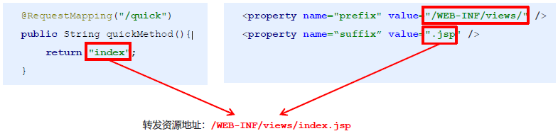
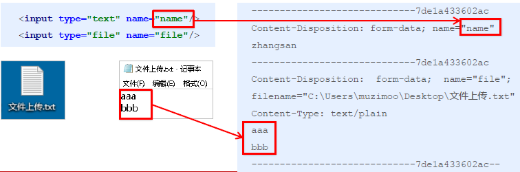

## 1. SpringMVC的数据响应

#### 1.1 SpringMVC的数据 响应方式

1）页面跳转

- 直接返回字符串
- 通过ModelAndView对象返回

2）回写数据

- 直接返回字符串
- 返回对象或集合


#### 1.2 页面跳转

##### 1. 返回字符串形式

直接返回字符串：此种方式会将返回的字符串与视图解析器的前后缀拼接后跳转。




返回带有前缀的字符串：

转发：`forward:/WEB-INF/views/index.jsp`

重定向：`redirect:/index.jsp`


##### 2. 返回ModelAndView对象

```java
@RequestMapping("/quick2")
public ModelAndView quickMethod2(){
    ModelAndView modelAndView = new ModelAndView();
    modelAndView.setViewName("redirect:index.jsp");
    return modelAndView;
}
@RequestMapping("/quick3")
public ModelAndView quickMethod3(){
    ModelAndView modelAndView = new ModelAndView();
    modelAndView.setViewName("forward:/WEB-INF/views/index.jsp");
    return modelAndView;
}
```

##### 3. 向request域存储数据

在进行转发时，往往要向request域中存储数据，在jsp页面中显示，那么Controller中怎样向request域中存储数据呢？

①通过SpringMVC框架注入的request对象setAttribute()方法设置
```java
@RequestMapping("/quick")
public String quickMethod(HttpServletRequest request){
    request.setAttribute("name","zhangsan");
    return "index";
}
```

②通过ModelAndView的addObject()方法设置

```java
@RequestMapping("/quick3")
public ModelAndView quickMethod3(){
    ModelAndView modelAndView = new ModelAndView();
    modelAndView.setViewName("forward:/WEB-INF/views/index.jsp");
    modelAndView.addObject("name","lisi");
    return modelAndView;
}
```

#### 1.3 回写数据

##### 1. 直接返回字符串

Web基础阶段，客户端访问服务器端，如果想直接回写字符串作为响应体返回的话，只需要使用`response.getWriter().print("hello world")` 即可，那么在Controller中想直接回写字符串该怎样呢？

①通过SpringMVC框架注入的response对象，使用`response.getWriter().print("hello world")` 回写数据，此时不需要视图跳转，业务方法返回值为void。
```java
@RequestMapping("/quick4")
public void quickMethod4(HttpServletResponse response) throws IOException {
    response.getWriter().print("hello world");
}
```

②将需要回写的字符串直接返回，但此时需要通过@ResponseBody注解告知SpringMVC框架，方法返回的字符串不是跳转是直接在http响应体中返回。
```java
@RequestMapping("/quick5")
@ResponseBody
public String quickMethod5() throws IOException {
    return "hello springMVC!!!";
}
```

在异步项目中，客户端与服务器端往往要进行json格式字符串交互，此时我们可以手动拼接json字符串返回。

```java
@RequestMapping("/quick6")
@ResponseBody
public String quickMethod6() throws IOException {
    return "{\"name\":\"zhangsan\",\"age\":18}";
}
```
上述方式手动拼接json格式字符串的方式很麻烦，开发中往往要将复杂的java对象转换成json格式的字符串，我们可以使用web阶段学习过的json转换工具jackson进行转换，导入jackson坐标。

```xml
<!--jackson-->
<dependency>
    <groupId>com.fasterxml.jackson.core</groupId>
    <artifactId>jackson-core</artifactId>
    <version>2.9.0</version>
</dependency>
<dependency>
    <groupId>com.fasterxml.jackson.core</groupId>
    <artifactId>jackson-databind</artifactId>
    <version>2.9.0</version>
</dependency>
<dependency>
    <groupId>com.fasterxml.jackson.core</groupId>
    <artifactId>jackson-annotations</artifactId>
    <version>2.9.0</version>
</dependency>
```
通过jackson转换json格式字符串，回写字符串。

```java
@RequestMapping("/quick7")
@ResponseBody
public String quickMethod7() throws IOException{
    User user= new User();
    user.setUsername("zhangsan");
    user.setAge(18);
    ObjectMapper objectMapper= new ObjectMapper();
    String s = objectMapper.writeValueAsString(user);
    return s;
}
```

##### 2. 返回对象或集合

通过SpringMVC帮助我们对对象或集合进行json字符串的转换并回写，为处理器适配器配置消息转换参数，指定使用jackson进行对象或集合的转换，因此需要在spring-mvc.xml中进行如下配置：

```xml
<bean class="org.springframework.web.servlet.mvc.method.annotation
                .RequestMappingHandlerAdapter">
    <property name="messageConverters">
        <list>
            <bean class="org.springframework.http.converter.json
                            .MappingJackson2HttpMessageConverter">
            </bean>
        </list>
    </property>
</bean>
```

```java
@RequestMapping("/quick8")
@ResponseBody
public User quickMethod8() throws IOException {
    User user = new User();
    user.setUsername("zhangsan");
    user.setAge(18);
    return user;
}
```

在方法上添加@ResponseBody就可以返回json格式的字符串，但是这样配置比较麻烦，配置的代码比较多，因此，我们可以使用mvc的注解驱动代替上述配置。

```xml
<!--mvc的注解驱动-->
<mvc:annotation-driven/>
```
在SpringMVC的各个组件中，处理器映射器、处理器适配器、视图解析器称为SpringMVC的三大组件。
使用`<mvc:annotation-driven>`自动加载`RequestMappingHandlerMapping`（处理映射器）和`RequestMappingHandlerAdapter`（处理适配器），可用在Spring-xml.xml配置文件中使用`<mvc:annotation-driven>`替代注解处理器和适配器的配置。
同时使用`<mvc:annotation-driven>`默认底层就会集成jackson进行对象或集合的json格式字符串的转换。

### 2. SpringMVC获得请求数据

#### 2.1 获得请求参数

客户端请求参数的格式是：`name=value&name=value… …`

服务器端要获得请求的参数，有时还需要进行数据的封装，SpringMVC可以接收如下类型的参数：

- 基本类型参数
- POJO类型参数
- 数组类型参数
- 集合类型参数

#### 2.2 获得基本类型参数

Controller中的业务**方法的参数名称**要与请求参数的name一致，参数值会自动映射匹配。

`http://localhost:8080/itheima_springmvc1/quick9?username=zhangsan&age=12`
```java
@RequestMapping("/quick9")
@ResponseBody
public void quickMethod9(String username,int age) throws IOException {
    System.out.println(username);
    System.out.println(age);
}
```

#### 2.3 获得POJO类型参数

Controller中的业务方法的**POJO参数的属性名**与请求参数的name一致，参数值会自动映射匹配。

`http://localhost:8080/itheima_springmvc1/quick9?username=zhangsan&age=12`

```java
public class User {
    private String username;
    private int age;
    getter/setter…
}

@RequestMapping("/quick10")
@ResponseBody
public void quickMethod10(User user) throws IOException {
    System.out.println(user);
}
```

#### 2.4 获得数组类型参数

Controller中的业务方法**数组名称**与请求参数的name一致，参数值会自动映射匹配。

`http://localhost:8080/itheima_springmvc1/quick11?strs=111&strs=222&strs=333`

```java
@RequestMapping("/quick11")
@ResponseBody
public void quickMethod11(String[] strs) throws IOException {
    System.out.println(Arrays.asList(strs));
}
```
#### 2.5 获得集合类型参数

获得集合参数时，要将集合参数包装到一个POJO中才可以。

```html
<form action="${pageContext.request.contextPath}/quick12" method="post">
    <input type="text" name="userList[0].username"><br>
    <input type="text" name="userList[0].age"><br>
    <input type="text" name="userList[1].username"><br>
    <input type="text" name="userList[1].age"><br>
    <input type="submit" value="提交"><br>
</form>
```

```java
@RequestMapping("/quick12")
@ResponseBody
public void quickMethod12(Vo vo) throws IOException {
    System.out.println(vo.getUserList());
}
```
```java
public class VO {
    private List<User> userList;

    public List<User> getUserList() {
        return userList;
    }
    public void setUserList(List<User> userList) {
        this.userList = userList;
    }
    @Override
    public String toString() {
        return "VO{" +
                "userList=" + userList +
                '}';
    }
}
```

当使用ajax提交时，可以指定contentType为json形式，那么在方法参数位置使用@RequestBody可以直接接收集合数据而无需使用POJO进行包装。

```javascript
<script>
    //模拟数据
    var userList = new Array();
    userList.push({username: "zhangsan",age: "20"});
    userList.push({username: "lisi",age: "20"});
    $.ajax({
        type: "POST",
        url: "/itheima_springmvc1/quick13",
        data: JSON.stringify(userList),
        contentType : 'application/json;charset=utf-8'
    });
</script>
```
当使用ajax提交时，可以指定contentType为json形式，那么在方法参数位置使用@RequestBody可以直接接收集合数据而无需使用POJO进行包装。

```java
@RequestMapping("/quick13")
@ResponseBody
public void quickMethod13(@RequestBody List<User> userList) throws IOException {
    System.out.println(userList);
}
```
注意：通过谷歌开发者工具抓包发现，没有加载到jquery文件，原因是SpringMVC的前端控制器DispatcherServlet的url-pattern配置的是/,代表对所有的资源都进行过滤操作，我们可以通过以下两种方式指定放行静态资源：

- 在spring-mvc.xml配置文件中指定放行的资源
<mvc:resources mapping="/js/**" location="/js/"/> 
- 使用`<mvc:default-servlet-handler/>` 标签

#### 2.6 请求数据乱码问题

当post请求时，数据会出现乱码，我们可以设置一个过滤器来进行编码的过滤。

```xml
<filter>
    <filter-name>CharacterEncodingFilter</filter-name>
    <filter-class>org.springframework.web.filter.CharacterEncodingFilter</filter-class>
    <init-param>
        <param-name>encoding</param-name>
        <param-value>UTF-8</param-value>
    </init-param>
</filter>
<filter-mapping>
    <filter-name>CharacterEncodingFilter</filter-name>
    <url-pattern>/*</url-pattern>
</filter-mapping>
```
#### 2.7 参数绑定注解@requestParam

当请求的参数名称与Controller的业务方法参数名称不一致时，就需要通过@RequestParam注解显示的绑定。

```html
<form action="${pageContext.request.contextPath}/quick14" method="post">
    <input type="text" name="name">
    <input type="submit" value="提交">
</form>
```
```java
@RequestMapping("/quick14")
@ResponseBody
public void quickMethod14(@RequestParam("name") String username) throws IOException {
    System.out.println(username);
}
```

注解@RequestParam还有如下参数可以使用：
- value：与请求参数名称
- required：此在指定的请求参数是否必须包括，默认是true，提交时如果没有此参数则报错
- defaultValue：当没有指定请求参数时，则使用指定的默认值赋值

```java
@RequestMapping("/quick14")
@ResponseBody
public void quickMethod14(@RequestParam(value="name",required = false,defaultValue = "itcast") String username) throws IOException {
    System.out.println(username);
}
```
#### 2.8 获得Restful风格的参数

Restful是一种软件架构风格、设计风格，而不是标准，只是提供了一组设计原则和约束条件。主要用于客户端和服务器交互类的软件，基于这个风格设计的软件可以更简洁，更有层次，更易于实现缓存机制等。

Restful风格的请求是使用“url+请求方式”表示一次请求目的的，HTTP 协议里面四个表示操作方式的动词如下：
- GET：用于获取资源
- POST：用于新建资源
- PUT：用于更新资源
- DELETE：用于删除资源

例如：
- /user/1    GET ：得到id = 1 的user
- /user/1    DELETE：删除id = 1 的user
- /user/1    PUT：更新id = 1 的user
- /user       POST：新增user

#### 2.8 获得Restful风格的参数

上述url地址/user/1中的1就是要获得的请求参数，在SpringMVC中可以使用**占位符**进行**参数绑定**。地址/user/1可以写成/user/{id}，**占位符`{id}`** 对应的就是1的值。在业务方法中我们可以使用@PathVariable注解进行占位符的匹配获取工作。

`http://localhost:8080/itheima_springmvc1/quick19/zhangsan`

```java
@RequestMapping("/quick19/{name}")
@ResponseBody
public void quickMethod19(@PathVariable(value = "name",required = true) String name){
    System.out.println(name);
}
```

#### 2.9 自定义类型转换器

- SpringMVC默认已经提供了一些常用的类型转换器，例如客户端提交的字符串转换成int型进行参数设置。
- 但是不是所有的数据类型都提供了转换器，没有提供的就需要自定义转换器，例如：日期类型的数据就需要自定义转换器。

自定义类型转换器的开发步骤：
①定义转换器类实现Converter接口
②在配置文件中声明转换器
③在<annotation-driven>中引用转换器

①定义转换器类实现Converter接口
```java
public class DateConverter implements Converter<String,Date>{
    @Override
    public Date convert(String source) {
        SimpleDateFormat format = new SimpleDateFormat("yyyy-MM-dd");
        try {
            Date date = format.parse(source);
            return date;
        } catch (ParseException e) {
            e.printStackTrace();
            }
        return null;
    }
}
```

②在配置文件中声明转换器
```XML
<bean id="converterService" class="org.springframework.context.support.ConversionServiceFactoryBean">
    <property name="converters">
        <list>
            <bean class="com.itheima.converter.DateConverter"/>
        </list>
    </property>    
</bean>
```

③在<annotation-driven>中引用转换器

`<mvc:annotation-driven conversion-service="converterService"/>`

#### 2.10 获得Servlet相关API

SpringMVC支持使用原始ServletAPI对象作为控制器方法的参数进行注入，常用的对象如下：

- HttpServletRequest
- HttpServletResponse
- HttpSession

```java
@RequestMapping("/quick16")
@ResponseBody
public void quickMethod16(HttpServletRequest request,HttpServletResponse response,HttpSession session){
    System.out.println(request);
    System.out.println(response);
    System.out.println(session);
}
```

#### 2.11 获得请求头

##### 1. @RequestHeader
使用@RequestHeader可以获得请求头信息，相当于web阶段学习的`request.getHeader(name)`

@RequestHeader注解的属性如下：
- value：请求头的名称
- required：是否必须携带此请求头

```java
@RequestMapping("/quick17")
@ResponseBody
public void quickMethod17(@RequestHeader(value = "User-Agent",required = false) String headerValue){
    System.out.println(headerValue);
}
```

##### 2. @CookieValue

使用@CookieValue可以获得指定Cookie的值

@CookieValue注解的属性如下：

- value：指定cookie的名称
- required：是否必须携带此cookie

```java
@RequestMapping("/quick18")
@ResponseBody
public void quickMethod18(@CookieValue(value = "JSESSIONID",required = false) String jsessionid){
    System.out.println(jsessionid);
}
```

#### 2.12 文件上传

##### 1. 文件上传客户端三要素


- 表单项type=“file”
- 表单的提交方式是post
- 表单的enctype属性是多部分表单形式，及enctype=“multipart/form-data”

```html
<form action="${pageContext.request.contextPath}/quick20" method="post" enctype="multipart/form-data">
    名称：<input type="text" name="name"><br>
    文件：<input type="file" name="file"><br>
    <input type="submit" value="提交"><br>
</form>
```

##### 2. 文件上传原理

- 当form表单修改为多部分表单时，request.getParameter()将失效。
- enctype=“application/x-www-form-urlencoded”时，form表单的正文内容格式是：`key=value&key=value&key=value`
- 当form表单的enctype取值为Mutilpart/form-data时，请求正文内容就变成多部分形式：




#### 2.13 单文件上传步骤

①导入fileupload和io坐标
②配置文件上传解析器
③编写文件上传代码

#### 2.14 单文件上传实现

①导入 fileupload 和 io 坐标
```xml
<dependency>
    <groupId>commons-fileupload</groupId>
    <artifactId>commons-fileupload</artifactId>
    <version>1.2.2</version>
</dependency>
<dependency>
    <groupId>commons-io</groupId>
    <artifactId>commons-io</artifactId>
    <version>2.4</version>
</dependency>
```

②配置文件上传解析器

```xml
<bean id="multipartResolver" 
class="org.springframework.web.multipart.commons.CommonsMultipartResolver">
    <!--上传文件总大小-->
    <property name="maxUploadSize" value="5242800"/>
    <!--上传单个文件的大小-->
    <property name="maxUploadSizePerFile" value="5242800"/>
    <!--上传文件的编码类型-->
    <property name="defaultEncoding" value="UTF-8"/>
</bean>
```

③编写文件上传代码

```java
@RequestMapping("/quick20")
@ResponseBody
public void quickMethod20(String name,MultipartFile uploadFile) throws IOException {
    //获得文件名称
    String originalFilename = uploadFile.getOriginalFilename();
    //保存文件
    uploadFile.transferTo(new File("C:\\upload\\"+originalFilename));
}
```

#### 2.15 多文件上传实现

多文件上传，只需要将页面修改为多个文件上传项，将方法参数MultipartFile类型修改为MultipartFile[]即可

```html
<h1>多文件上传测试</h1>
<form action="${pageContext.request.contextPath}/quick21" method="post" 
enctype="multipart/form-data">
    名称：<input type="text" name="name"><br>
    文件1：<input type="file" name="uploadFiles"><br>
    文件2：<input type="file" name="uploadFiles"><br>
    文件3：<input type="file" name="uploadFiles"><br>
    <input type="submit" value="提交"><br>
</form>
```

```java
@RequestMapping("/quick21")
@ResponseBody
public void quickMethod21(String name,MultipartFile[] uploadFiles) throws IOException {
    for (MultipartFile uploadFile : uploadFiles){
        String originalFilename = uploadFile.getOriginalFilename();
        uploadFile.transferTo(new File("C:\\upload\\"+originalFilename));
        }
}
```


