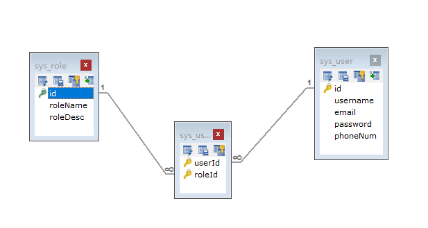
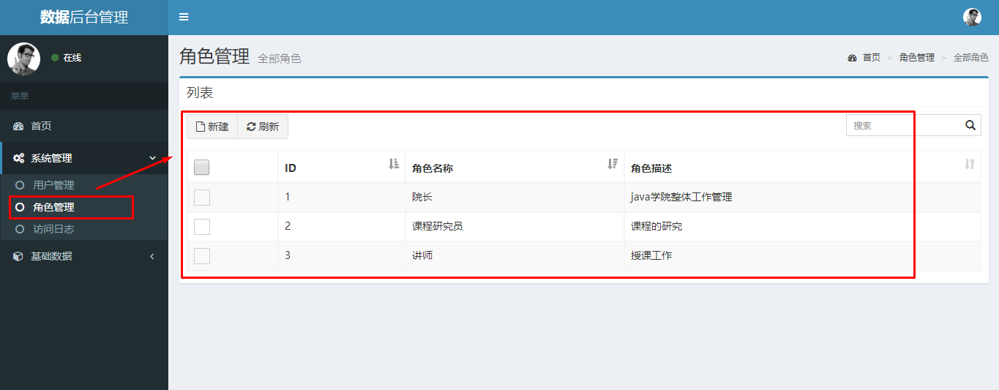
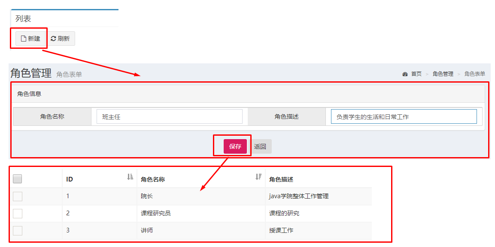
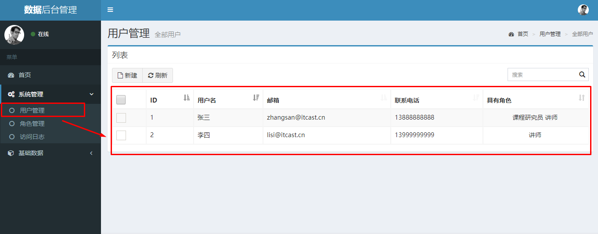
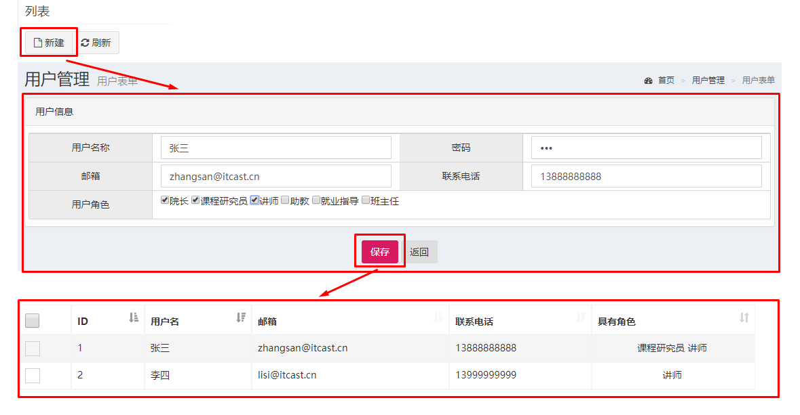
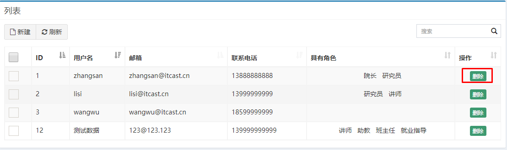

### 1. Spring练习环境搭建

#### 1.1 Spring环境搭建步骤

①创建工程（Project&Module）
②导入静态页面（见资料jsp页面）
③导入需要坐标（见资料中的pom.xml）
④创建包结构（controller、service、dao、domain、utils）
⑤导入数据库脚本（见资料test.sql）
⑥创建POJO类（见资料User.java和Role.java）
⑦创建配置文件（applicationContext.xml、spring-mvc.xml、jdbc.properties、log4j.properties）

#### 1.2 用户和角色的关系

### 2.角色列表的展示和添加操作

#### 2.1 角色列表的展示效果

#### 2.2 角色列表的展示步骤分析

①点击角色管理菜单发送请求到服务器端（修改角色管理菜单的url地址）
②创建RoleController和showList()方法
③创建RoleService和showList()方法
④创建RoleDao和findAll()方法
⑤使用JdbcTemplate完成查询操作
⑥将查询数据存储到Model中
⑦转发到role-list.jsp页面进行展示

#### 2.3 角色添加的效果

#### 2.4 角色添加的步骤分析

①点击列表页面新建按钮跳转到角色添加页面
②输入角色信息，点击保存按钮，表单数据提交服务器
③编写RoleController的save()方法
④编写RoleService的save()方法
⑤编写RoleDao的save()方法
⑥使用JdbcTemplate保存Role数据到sys_role
⑦跳转回角色列表页面

### 3.用户列表的展示和添加操作

#### 3.1 用户列表的展示效果

#### 3.2 用户列表的展示步骤分析

①点击用户管理菜单发送请求到服务器端（修改用户管理菜单的url地址）
②创建RoleController和showList()方法
③创建RoleService和showList()方法
④创建RoleDao和findAll()方法
⑤使用JdbcTemplate完成查询操作
⑥将查询数据存储到Model中
⑦转发到user-list.jsp页面进行展示

#### 3.3 用户添加的效果

#### 3.4 用户添加的步骤分析

①点击列表页面新建按钮跳转到角色添加页面
②输入角色信息，点击保存按钮，表单数据提交服务器
③编写RoleController的save()方法
④编写RoleService的save()方法
⑤编写RoleDao的save()方法
⑥使用JdbcTemplate保存Role数据到sys_role
⑦跳转回角色列表页面

### 4. 删除用户操作

#### 4.1 删除用户的效果

#### 4.2 删除用户的步骤分析

①点击用户列表的删除按钮，发送请求到服务器端
②编写UserController的deleteById()方法
③编写UserService的deleteById()方法
④编写UserDao的deleteById()方法
⑤编写UserDao的deleteRelByUid()方法
⑥跳回当前用户列表页面

