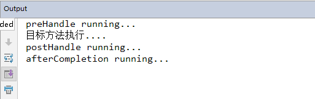
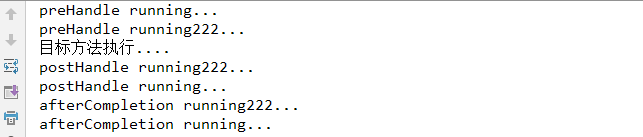
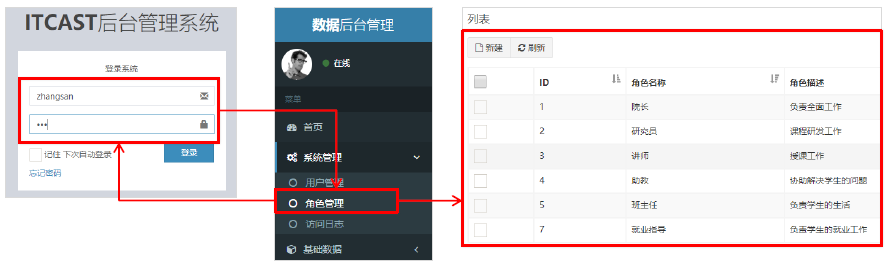

### 1.SpringMVC 拦截器

#### 1.1 拦截器（interceptor）的作用

Spring MVC 的**拦截器**类似于Servlet 开发中的过滤器Filter，用于对处理器进行**预处理**和**后处理**。

将拦截器按一定的顺序联结成一条链，这条链称为**拦截器链**（Interceptor Chain）。在访问被拦截的方法或字段时，拦截器链中的拦截器就会按其之前定义的顺序被调用。拦截器也是AOP思想的具体实现。

#### 1.2 拦截器和过滤器区别


| 区别 | 过滤器 | 拦截器 |
| --- | --- | --- |
| 使用范围 | 是servlet 规范中的一部分，任何Java Web 工程都可以使用 | 是SpringMVC 框架自己的，只有使用了SpringMVC 框架的工程才能用 |
| 拦截范围 | 在url pattern 中配置了`/*`之后，可以对所有要访问的资源拦截 | 只会拦截访问的控制器方法，如果访问的是jsp,html,css,image 或者 js 是不会进行拦截的 |

#### 1.3 拦截器是快速入门

自定义拦截器很简单，只有如下三步：

①创建拦截器类实现HandlerInterceptor接口
②配置拦截器
③测试拦截器的拦截效果

①创建拦截器类实现HandlerInterceptor接口
```java
public class MyHandlerInterceptor1 implements HandlerInterceptor {
    public boolean preHandle(HttpServletRequest request, HttpServletResponse response, Object handler) {
        System.out.println("preHandle running...");
        String param = request.getParameter("param");
        if("yes".equals(param)){
            return true;
        } esle {
            request.getRequestDispatcher("/error.jsp").forward(request,response);
            reurn false;
        }
    }
    public void postHandle(HttpServletRequest request, HttpServletResponse response, Object handler, ModelAndView modelAndView) {
        modelAndView.addObject("name","itheima");
        System.out.println("postHandle running...");
    }
    public void afterCompletion(HttpServletRequest request, HttpServletResponse response, Object handler, Exception ex) {
        System.out.println("afterCompletion running...");
    }
}
```

②配置拦截器

```xml
<!--配置拦截器-->
<mvc:interceptors>
    <mvc:interceptor>
        <mvc:mapping path="/**"/>
        <bean class="com.itheima.interceptor.MyHandlerInterceptor1"/>
    </mvc:interceptor>
    <mvc:interceptor>
        <mvc:mapping path="/**"/>
        <bean class="com.itheima.interceptor.MyHandlerInterceptor2"/>
    </mvc:interceptor>
</mvc:interceptors>
```
```xml
<!--配置拦截器-->
<mvc:interceptors>
    <mvc:interceptor>
        <mvc:mapping path="/**"/>
        <mvc:exclude-mapping path="/user/login"/>
        <bean class="com.itheima.interceptor.MyHandlerInterceptor1"/>
    </mvc:interceptor>
</mvc:interceptors>
```
③测试拦截器的拦截效果（编写目标方法）

```java
@RequestMapping("/quick23")
@ResponseBody
public ModelAndViewquickMethod23() throws IOException, ParseException{
    System.out.println("目标方法执行....");
    ModelAndView modelAndView= new ModelAndView();
    modelAndView.addObject("name","itcast");
    modelAndView.setViewName("index");
    return modelAndView;
}
```
`http://localhost:8080/itheima_springmvc1/quick23`

控制台打印结果



#### 1.4 多拦截器操作

同上，在编写一个MyHandlerInterceptor2操作，测试执行顺序



#### 1.5 拦截器方法说明


| 方法名 | 说明 |
| --- | --- |
| preHandle() | 方法将在请求处理之前进行调用，该方法的返回值是布尔值Boolean 类型的，当它返回为 false 时，表示请求结束，后续的 Interceptor 和 Controller 都不会再执行；当返回值为 true 时就会继续调用下一个 Interceptor 的 preHandle 方法 |
| postHandle() | 该方法是在当前请求进行处理之后被调用，前提是preHandle 方法的返回值为true 时才能被调用，且它会在 DispatcherServlet 进行视图返回渲染之前被调用，所以我们可以在这个方法中对 Controller 处理之后的 ModelAndView 对象进行操作 |
| afterCompletion() | 该方法将在整个请求结束之后，也就是在DispatcherServlet 渲染了对应的视图之后执行，前提是 preHandle 方法的返回值为 true 时才能被调用 |

#### 1.6 知识要点

自定义拦截器步骤

①创建拦截器类实现HandlerInterceptor接口
②配置拦截器
③测试拦截器的拦截效果

#### 1.7 案例-用户登录权限控制

需求：用户没有登录的情况下，不能对后台菜单进行访问操作，点击菜单跳转到登录页面，只有用户登录成功后才能进行后台功能的操作



