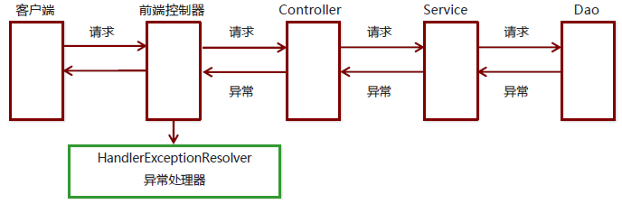

### 1. SpringMVC异常处理

#### 1.1 异常处理的思路


系统中异常包括两类：预期异常和运行时异常RuntimeException，前者通过捕获异常从而获取异常信息，后者主要通过规范代码开发、测试等手段减少运行时异常的发生。

系统的Dao、Service、Controller出现都通过throws Exception向上抛出，最后由SpringMVC前端控制器交由异常处理器进行异常处理，如下图：



#### 1.2 异常处理两种方式

- 使用Spring MVC提供的简单异常处理器SimpleMappingExceptionResolver
- 实现Spring的异常处理接口HandlerExceptionResolver自定义自己的异常处理器

#### 1.3 简单异常处理器SimpleMappingExceptionResolver

SpringMVC已经定义好了该类型转换器，在使用时可以根据项目情况进行相应异常与视图的映射配置

```xml
<!--配置简单映射异常处理器-->
<bean class=“org.springframework.web.servlet.handler.SimpleMappingExceptionResolver”>
    <property name=“defaultErrorView” value=“error”/>   默认错误视图
    <property name=“exceptionMappings”>
        <map>                       异常类型                                    错误视图
            <entry key="com.itheima.exception.MyException" value="error1"/>
            <entry key="java.lang.ClassCastException" value="error2"/>
        </map>
    </property>
</bean>
```


#### 1.4 自定义异常处理步骤

①创建异常处理器类实现HandlerExceptionResolver
②配置异常处理器
③编写异常页面
④测试异常跳转


①创建异常处理器类实现HandlerExceptionResolver

```java
public class MyExceptionResolver implements HandlerExceptionResolver {
    @Override 
    public ModelAndView resolveException(HttpServletRequest request, HttpServletResponse response, Object handler, Exception ex) {
        //处理异常的代码实现
        //创建ModelAndView对象
        ModelAndView modelAndView = new ModelAndView();
        if(e instanceof MyException){
            modelAndView.addObject("info","自定义异常");
        } else if(e instanceof ClassCastException){
            modelAndView.addObject("info","类型转换异常");
        }
        modelAndView.setViewName("error");
        return modelAndView;
    }
}
```

②配置异常处理器

```xml
<bean id="exceptionResolver" class="com.itheima.exception.MyExceptionResolver"/>
```


③编写异常页面

```html
<%@ page contentType="text/html;charset=UTF-8" language="java" 
%>
<html>
<head>
    <title>Title</title>
</head>
<body>
    <h1>${info}</h1>
    这是一个最终异常的显示页面
</body>
</html>
```

④测试异常跳转

```java
@RequestMapping("/quick22")
@ResponseBody
public void quickMethod22() throws IOException, ParseException {
    SimpleDateFormat simpleDateFormat = new SimpleDateFormat("yyyy-MM-dd");
    simpleDateFormat.parse("abcde");
}
```


#### 1.5 知识要点

**异常处理方式**

- 配置简单异常处理器SimpleMappingExceptionResolver
- 自定义异常处理器

**自定义异常处理步骤**

①创建异常处理器类实现HandlerExceptionResolver
②配置异常处理器
③编写异常页面
④测试异常跳转
