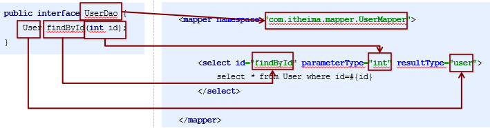
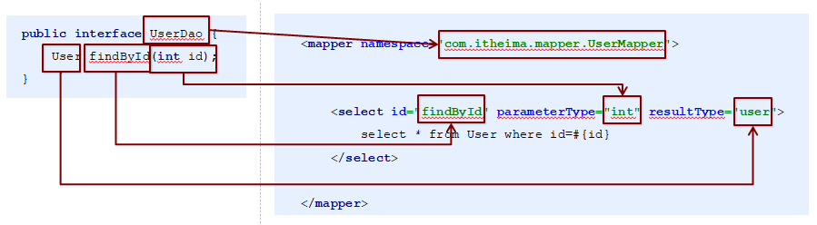

### 1.Mybatis的Dao层实现

#### 1.1 传统开发方式

1. 编写UserDao接口

```java
public interface UserDao {
    List<User> findAll() throws IOException;
}
```

2. 编写UserDaoImpl实现

```java
public class UserDaoImpl implements UserDao {
    public List<User> findAll() throws IOException {
        InputStream resourceAsStream = Resources.getResourceAsStream("SqlMapConfig.xml");
        SqlSessionFactory sqlSessionFactory = new SqlSessionFactoryBuilder().build(resourceAsStream);
        SqlSession sqlSession = sqlSessionFactory.openSession();
        List<User> userList = sqlSession.selectList("userMapper.findAll");
        sqlSession.close();
        return userList;
    }
}
```
### 3. 测试传统方式

```java
@Test
public void testTraditionDao() throws IOException {
    UserDao userDao = new UserDaoImpl();
    List<User> all = userDao.findAll();
    System.out.println(all);
}
```

#### 1.2 代理开发方式

1. 代理开发方式介绍

    采用Mybatis的代理开发方式实现DAO 层的开发，这种方式是我们后面进入企业的主流。

    Mapper 接口开发方法只需要程序员编写Mapper 接口（相当于Dao 接口），由Mybatis框架根据接口定义创建接口的动态代理对象，代理对象的方法体同上边Dao接口实现类方法。

    Mapper 接口开发需要遵循以下规范：

    1、Mapper.xml文件中的namespace与mapper接口的全限定名相同

    2、Mapper接口方法名和Mapper.xml中定义的每个statement的id相同

    3、Mapper接口方法的输入参数类型和mapper.xml中定义的每个sql的parameterType的类型相同

    4、Mapper接口方法的输出参数类型和mapper.xml中定义的每个sql的resultType的类型相同

#### 1.2 代理开发方式

2. 编写UserMapper接口



3. 测试代理方式

```java
@Test
public void testProxyDao() throws IOException {
    InputStream resourceAsStream = Resources.getResourceAsStream("SqlMapConfig.xml");
    SqlSessionFactory sqlSessionFactory = new SqlSessionFactoryBuilder().build(resourceAsStream);
    SqlSession sqlSession = sqlSessionFactory.openSession();
    //获得MyBatis框架生成的UserMapper接口的实现类
  UserMapper userMapper = sqlSession.getMapper(UserMapper.class);
    User user = userMapper.findById(1);
    System.out.println(user);
    sqlSession.close();
}
```

#### 1.3 知识小结

MyBatis的Dao层实现的两种方式：

- 手动对Dao进行实现：传统开发方式
- 代理方式对Dao进行实现：

`UserMapperuserMapper = sqlSession.getMapper(UserMapper.class);`



