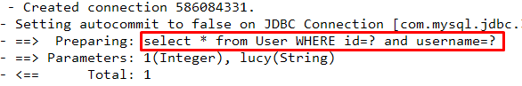
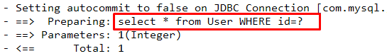
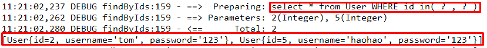

### 1.MyBatis映射文件深入

### 1.1 动态sql语句

1. 动态sql语句概述

    Mybatis的映射文件中，前面我们的SQL 都是比较简单的，有些时候业务逻辑复杂时，我们的SQL是动态变化的，此时在前面的学习中我们的SQL 就不能满足要求了。

参考的官方文档，描述如下：

.png)

2. 动态SQL  之<if> 

    我们根据实体类的不同取值，使用不同的SQL语句来进行查询。比如在id如果不为空时可以根据id查询，如果username 不同空时还要加入用户名作为条件。这种情况在我们的多条件组合查询中经常会碰到。

```xml
<select id="findByCondition" parameterType="user" resultType="user">
    select * from User
    <where>
        <if test="id!=0">
            and id=#{id}
        </if>
        <if test="username!=null">
            and username=#{username}
        </if>
    </where>
</select>
```
当查询条件id和username都存在时，控制台打印的sql语句如下：

```java
     … … …
     //获得MyBatis框架生成的UserMapper接口的实现类
  UserMapper userMapper = sqlSession.getMapper(UserMapper.class);
    User condition = new User();
    condition.setId(1);
    condition.setUsername("lucy");
    User user = userMapper.findByCondition(condition);
    … … …
```



当查询条件只有id存在时，控制台打印的sql语句如下：

```java
     … … …
     //获得MyBatis框架生成的UserMapper接口的实现类
  UserMapper userMapper = sqlSession.getMapper(UserMapper.class);
    User condition = new User();
    condition.setId(1);
    User user = userMapper.findByCondition(condition);
    … … …
```



3. 动态SQL  之<foreach> 

    循环执行sql的拼接操作，例如：SELECT * FROM USER WHERE id IN (1,2,5)。

```xml
<select id="findByIds" parameterType="list" resultType="user">
    select * from User
    <where>
        <foreach collection="array" open="id in(" close=")" item="id" separator=",">
            #{id}
        </foreach>
    </where>
</select>
```

测试代码片段如下：

```java
     … … …
     //获得MyBatis框架生成的UserMapper接口的实现类
  UserMapper userMapper = sqlSession.getMapper(UserMapper.class);
    int[] ids = new int[]{2,5};
    List<User> userList = userMapper.findByIds(ids);
    System.out.println(userList);
    … … …
```



foreach标签的属性含义如下：

`<foreach>`标签用于遍历集合，它的属性：

- collection：代表要遍历的集合元素，注意编写时不要写#{}
- open：代表语句的开始部分
- close：代表结束部分
- item：代表遍历集合的每个元素，生成的变量名
- sperator：代表分隔符

#### 1.2 SQL片段抽取

Sql中可将重复的sql提取出来，使用时用include 引用即可，最终达到sql重用的目的

```xml
<!--抽取sql片段简化编写-->
<sql id="selectUser" select * from User</sql>
<select id="findById" parameterType="int" resultType="user">
    <include refid="selectUser"></include> where id=#{id}
</select>
<select id="findByIds" parameterType="list" resultType="user">
    <include refid="selectUser"></include>
    <where>
        <foreach collection="array" open="id in(" close=")" item="id" separator=",">
            #{id}
        </foreach>
    </where>
</select>
```

#### 1.3 知识小结

MyBatis映射文件配置：
`<select>`：查询
`<insert>`：插入
`<update>`：修改
`<delete>`：删除
`<where>`：where条件
`<if>`：if判断
`<foreach>`：循环
`<sql>`：sql片段抽取
