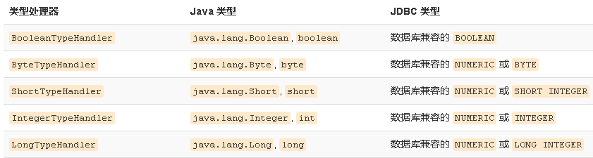
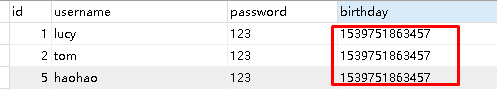
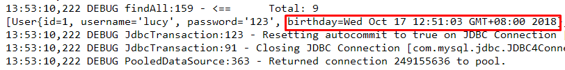

### 1. MyBatis核心配置文件深入

#### 1.1 typeHandlers标签

无论是MyBatis在预处理语句（PreparedStatement）中设置一个参数时，还是从结果集中取出一个值时，都会用类型处理器将获取的值以合适的方式转换成Java 类型。下表描述了一些默认的类型处理器（截取部分）。



你可以重写类型处理器或创建你自己的类型处理器来处理不支持的或非标准的类型。具体做法为：实现org.apache.ibatis.type.TypeHandler接口，或继承一个很便利的类org.apache.ibatis.type.BaseTypeHandler，然后可以选择性地将它映射到一个JDBC类型。例如需求：一个Java中的Date数据类型，我想将之存到数据库的时候存成一个1970年至今的毫秒数，取出来时转换成java的Date，即java的Date与数据库的varchar毫秒值之间转换。

开发步骤：

①定义转换类继承类BaseTypeHandler<T>
②覆盖4个未实现的方法，其中setNonNullParameter为java程序设置数据到数据库的回调方法，getNullableResult为查询时mysql的字符串类型转换成java的Type类型的方法
③在MyBatis核心配置文件中进行注册
④测试转换是否正确

```java
public class MyDateTypeHandler extends BaseTypeHandler<Date> {
    public void setNonNullParameter(PreparedStatement preparedStatement, int i, Date date, JdbcType type) {
        preparedStatement.setString(i,date.getTime()+"");
    }
    public Date getNullableResult(ResultSet resultSet, String s) throws SQLException {
        return new Date(resultSet.getLong(s));
    }
    public Date getNullableResult(ResultSet resultSet, int i) throws SQLException {
        return new Date(resultSet.getLong(i));
    }
    public Date getNullableResult(CallableStatement callableStatement, int i) throws SQLException {
        return callableStatement.getDate(i);
    }
}
```

```xml
<!--注册类型自定义转换器-->
<typeHandlers>
    <typeHandler handler="com.itheima.typeHandlers.MyDateTypeHandler"></typeHandler>
</typeHandlers>
```

测试添加操作：

```java
user.setBirthday(new Date());
userMapper.add2(user);
```



测试查询操作：



#### 1.2 plugins标签

MyBatis可以使用第三方的插件来对功能进行扩展，分页助手PageHelper是将分页的复杂操作进行封装，使用简单的方式即可获得分页的相关数据

开发步骤：

①导入通用PageHelper的坐标
②在mybatis核心配置文件中配置PageHelper插件
③测试分页数据获取


①导入通用 PageHelper 坐标

```xml
<!-- 分页助手 -->
<dependency>
    <groupId>com.github.pagehelper</groupId>
    <artifactId>pagehelper</artifactId>
    <version>3.7.5</version>
</dependency>
<dependency>
    <groupId>com.github.jsqlparser</groupId>
    <artifactId>jsqlparser</artifactId>
    <version>0.9.1</version>
</dependency>
```

②在mybatis核心配置文件中配置PageHelper插件

```xml
<!-- 注意：分页助手的插件  配置在通用馆mapper之前 -->
<plugin interceptor="com.github.pagehelper.PageHelper">
    <!-- 指定方言 -->
    <property name="dialect" value="mysql"/>
</plugin>
```

③测试分页代码实现

```java
@Test
public void testPageHelper(){
    //设置分页参数
    PageHelper.startPage(1,2);

    List<User> select = userMapper2.select(null);
    for(User user : select){
        System.out.println(user);
    }
}
```

获得分页相关的其他参数

```java
//其他分页的数据
PageInfo<User> pageInfo = new PageInfo<User>(select);
System.out.println("总条数："+pageInfo.getTotal());
System.out.println("总页数："+pageInfo.getPages());
System.out.println("当前页："+pageInfo.getPageNum());
System.out.println("每页显示长度："+pageInfo.getPageSize());
System.out.println("是否第一页："+pageInfo.isIsFirstPage());
System.out.println("是否最后一页："+pageInfo.isIsLastPage());
```

#### 1.3 知识小结

MyBatis核心配置文件常用标签：

1、properties标签：该标签可以加载外部的properties文件
2、typeAliases标签：设置类型别名
3、environments标签：数据源环境配置标签
4、typeHandlers标签：配置自定义类型处理器
5、plugins标签：配置MyBatis的插件

