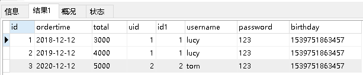
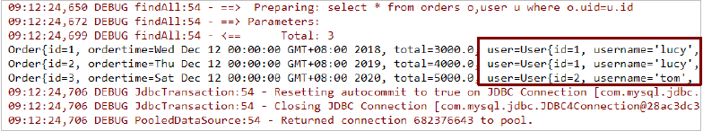
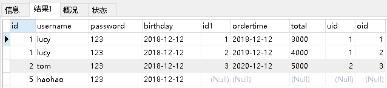
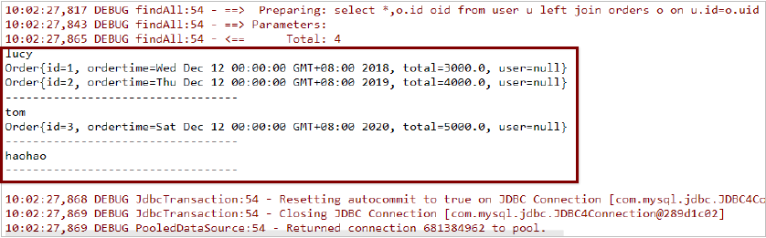
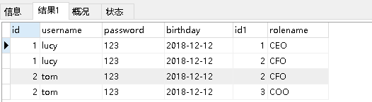
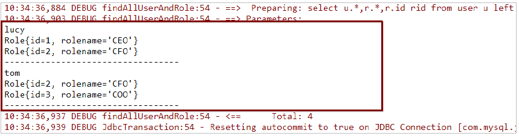

### 1.Mybatis多表查询

#### 1.1 一对一查询

1. 一对一查询的模型

用户表和订单表的关系为，一个用户有多个订单，一个订单只从属于一个用户
一对一查询的需求：查询一个订单，与此同时查询出该订单所属的用户


2. 一对一查询的语句

对应的sql语句：select *  from orders o,user u where o.uid=u.id;

查询的结果如下：



3.  创建Order和User实体

```java
public class Order {
    private int id;
    private Date ordertime;
    private double total;

    //代表当前订单从属于哪一个客户
    private User user;
}
```

```java
public class User {
    
    private int id;
    private String username;
    private String password;
    private Date birthday;
}
```

4.  创建OrderMapper接口

```java
public interface OrderMapper {
    List<Order> findAll();
}
```

5.  配置OrderMapper.xml

```xml
<mapper namespace="com.itheima.mapper.OrderMapper">
    <resultMap id="orderMap" type="com.itheima.domain.Order">
        <id column="oid" property="id"></id>
        <result column="ordertime" property="ordertime"></result>
        <result column="total" property="total"></result>
        <result column="uid" property="user.id"></result>
        <result column="username" property="user.username"></result>
        <result column="password" property="user.password"></result>
        <result column="birthday" property="user.birthday"></result>
    </resultMap>
    <select id="findAll" resultMap="orderMap">
        select *,o.id oid from orders o,user u where o.uid=u.id
    </select>
</mapper>
```

其中<resultMap>还可以配置如下：

```xml
<resultMap id="orderMap" type="com.itheima.domain.Order">
    <id column="id" property="id"></id>
    <result column="ordertime" property="ordertime"></result>
    <result column="total" property="total"></result>
    <association property="user" javaType="com.itheima.domain.User">
        <id column="uid" property="id"></id>
        <result column="username" property="username"></result>
        <result column="password" property="password"></result>
        <result column="birthday" property="birthday"></result>
    </association>
</resultMap>
```
6.  测试结果

```java
OrderMapper mapper = sqlSession.getMapper(OrderMapper.class);
List<Order> all = mapper.findAll();
for(Order order : all){
    System.out.println(order);
}
```



#### 1.2 一对多查询

1. 一对多查询的模型

用户表和订单表的关系为，一个用户有多个订单，一个订单只从属于一个用户
一对多查询的需求：查询一个用户，与此同时查询出该用户具有的订单

.png)

2. 一对多查询的语句

对应的sql语句：`select *,o.id oidfrom user u left join orders o on u.id=o.uid;`

查询的结果如下：



3.  修改User实体

```java
public class Order {

    private int id;
    private Date ordertime;
    private double total;

    //代表当前订单从属于哪一个客户
    private User user;
}
```

```java
public class User {
    
    private int id;
    private String username;
    private String password;
    private Date birthday;
    //代表当前用户具备哪些订单
    private List<Order> orderList;
}
```

4.  创建UserMapper接口

```java
public interface UserMapper {
    List<User> findAll();
}
```

5.  配置UserMapper.xml

```xml
<mapper namespace="com.itheima.mapper.UserMapper">
    <resultMap id="userMap" type="com.itheima.domain.User">
        <id column="id" property="id"></id>
        <result column="username" property="username"></result>
        <result column="password" property="password"></result>
        <result column="birthday" property="birthday"></result>
        <collection property="orderList" ofType="com.itheima.domain.Order">
            <result column="oid" property="id"></result>
            <result column="ordertime" property="ordertime"></result>
            <result column="total" property="total"></result>
        </collection>
    </resultMap>
    <select id="findAll" resultMap="userMap">
        select *,o.id oid from user u left join orders o on u.id=o.uid
    </select>
</mapper>
```

6.  测试结果

```java
UserMapper mapper = sqlSession.getMapper(UserMapper.class);
List<User> all = mapper.findAll();
for(User user : all){
    System.out.println(user.getUsername());
    List<Order> orderList = user.getOrderList();
    for(Order order : orderList){
        System.out.println(order);
    }
    System.out.println("----------------------------------");
}
```



#### 1.3 多对多查询

1. 多对多查询的模型

用户表和角色表的关系为，一个用户有多个角色，一个角色被多个用户使用

多对多查询的需求：查询用户同时查询出该用户的所有角色


2. 多对多查询的语句

对应的sql语句：`select u.*,r.*,r.id rid from user u left join user_roleuron u.id=ur.user_id inner join role r on ur.role_id=r.id;`

查询的结果如下：



3.  创建Role实体，修改User实体

```java
public class User {
    private int id;
    private String username;
    private String password;
    private Date birthday;
    //代表当前用户具备哪些订单
    private List<Order> orderList;
    //代表当前用户具备哪些角色
    private List<Role> roleList;
}
```

```java
public class Role {

    private int id;
    private String rolename;
}
```

4.  添加UserMapper接口方法

```java
List<User> findAllUserAndRole();
```

5.  配置UserMapper.xml

```xml
<resultMap id="userRoleMap" type="com.itheima.domain.User">
    <result column="id" property="id"></result>
    <result column="username" property="username"></result>
    <result column="password" property="password"></result>
    <result column="birthday" property="birthday"></result>
    <collection property="roleList" ofType="com.itheima.domain.Role">
        <result column="rid" property="id"></result>
        <result column="rolename" property="rolename"></result>
    </collection>
</resultMap>
<select id="findAllUserAndRole" resultMap="userRoleMap">
    select u.*,r.*,r.id rid from user u left join user_role ur on u.id=ur.user_id
    inner join role r on ur.role_id=r.id
</select>
```

6.  测试结果

```java
UserMapper mapper = sqlSession.getMapper(UserMapper.class);
List<User> all = mapper.findAllUserAndRole();
for(User user : all){
    System.out.println(user.getUsername());
    List<Role> roleList = user.getRoleList();
    for(Role role : roleList){
        System.out.println(role);
    }
    System.out.println("----------------------------------");
}

```



#### 1.4 知识小结

MyBatis多表配置方式：

一对一配置：使用`<resultMap>`做配置
一对多配置：使用`<resultMap>+<collection>`做配置
多对多配置：使用`<resultMap>+<collection>`做配置

