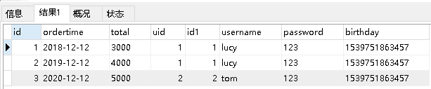
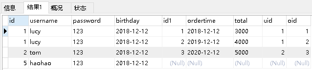
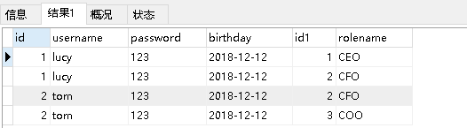

### 1.Mybatis的注解开发

#### 1.1 MyBatis的常用注解

这几年来注解开发越来越流行，Mybatis也可以使用注解开发方式，这样我们就可以减少编写Mapper

映射文件了。我们先围绕一些基本的CRUD来学习，再学习复杂映射多表操作。

@Insert：实现新增
@Update：实现更新
@Delete：实现删除
@Select：实现查询
@Result：实现结果集封装
@Results：可以与@Result 一起使用，封装多个结果集
@One：实现一对一结果集封装
@Many：实现一对多结果集封装

#### 1.2 MyBatis的增删改查

我们完成简单的user表的增删改查的操作

```java
private UserMapper userMapper;

@Before
public void before() throws IOException {
    InputStream resourceAsStream = Resources.getResourceAsStream("SqlMapConfig.xml");
    SqlSessionFactory sqlSessionFactory = new SqlSessionFactoryBuilder().build(resourceAsStream);
    SqlSession sqlSession = sqlSessionFactory.openSession(true);
    userMapper = sqlSession.getMapper(UserMapper.class);
}
@Test
public void testAdd() {
    User user = new User();
    user.setUsername("测试数据");
    user.setPassword("123");
    user.setBirthday(new Date());
    userMapper.add(user);
}
@Test
public void testUpdate() throws IOException {
    User user = new User();
    user.setId(16);
    user.setUsername("测试数据修改");
    user.setPassword("abc");
    user.setBirthday(new Date());
    userMapper.update(user);
}
@Test
public void testDelete() throws IOException {
    userMapper.delete(16);
}
@Test
public void testFindById() throws IOException {
    User user = userMapper.findById(1);
    System.out.println(user);
}
@Test
public void testFindAll() throws IOException {
    List<User> all = userMapper.findAll();
    for(User user : all){
        System.out.println(user);
    }
}
```

修改MyBatis的核心配置文件，我们使用了注解替代的映射文件，所以我们只需要加载使用了注解的Mapper接口即可

```xml
<mappers>
    <!--扫描使用注解的类-->
    <mapper class="com.itheima.mapper.UserMapper"></mapper>
</mappers>
```

或者指定扫描包含映射关系的接口所在的包也可以

```xml
<mappers>
    <!--扫描使用注解的类所在的包-->
    <package name="com.itheima.mapper"></package>
</mappers>
```

接口中方法上添加注解即可
```java
public interface UserMapper {

    @Insert("insert into user values(#{id},#{username},#{password},#{birthday})")
    public void save(User user);

    @Update("update user set username=#{username},password=#{password} where id=#{id}")
    public void update(User user);

    @Delete("delete from user where id=#{id}")
    public void delete(int id);

    @Select("select * from user where id=#{id}")
    public User findById(int id);

    @Select("select * from user")
    public List<User> findAll();
}
```


#### 1.3 MyBatis的注解实现复杂映射开发

实现复杂关系映射之前我们可以在映射文件中通过配置<resultMap>来实现，使用注解开发后，我们可以使用@Results注解，@Result注解，@One注解，@Many注解组合完成复杂关系的配置

| **注解** | **说明**                                                     |
| -------- | ------------------------------------------------------------ |
| @Results | 代替的是标签<resultMap>该注解中可以使用单个@Result注解，也可以使用@Result集合。使用格式：@Results（{@Result（），@Result（）}）或@Results（@Result（）） |
| @Resut   | 代替了<id>标签和<result>标签  @Result中属性介绍：  column：数据库的列名  property：需要装配的属性名  one：需要使用的@One  注解（@Result（one=@One）（）））  many：需要使用的@Many  注解（@Result（many=@many）（））） |
| @One （一对一）  | 代替了<assocation> 标签，是多表查询的关键，在注解中用来指定子查询返回单一对象。  @One注解属性介绍：  select: 指定用来多表查询的 sqlmapper  使用格式：@Result(column="  ",property="",one=@One(select="")) |
| @Many （多对一） | 代替了<collection>标签, 是是多表查询的关键，在注解中用来指定子查询返回对象集合。  使用格式：@Result(property="",column="",many=@Many(select="")) |

#### 1.4 一对一查询

1. 一对一查询的模型

用户表和订单表的关系为，一个用户有多个订单，一个订单只从属于一个用户
一对一查询的需求：查询一个订单，与此同时查询出该订单所属的用户


2. 一对一查询的语句

对应的sql语句：

`select * from orders;`

`select * from user where id=查询出订单的uid;`

查询的结果如下：



3.  创建Order和User实体

```java
public class Order {

    private int id;
    private Date ordertime;
    private double total;

    //代表当前订单从属于哪一个客户
    private User user;
}
```

```java
public class User {
    
    private int id;
    private String username;
    private String password;
    private Date birthday;
}
```

4.  创建OrderMapper接口

```java
public interface OrderMapper {
    List<Order> findAll();
}
```

5.  使用注解配置Mapper


6.  测试结果

```java
@Test
public void testSelectOrderAndUser() {
    List<Order> all = orderMapper.findAll();
    for(Order order : all){
        System.out.println(order);
    }
}
```


#### 1.5 一对多查询

1. 一对多查询的模型

用户表和订单表的关系为，一个用户有多个订单，一个订单只从属于一个用户

一对多查询的需求：查询一个用户，与此同时查询出该用户具有的订单

.png)

2. 一对多查询的语句

对应的sql语句：

`select * from user;`

`select * from orders where uid=查询出用户的id;`

查询的结果如下：



3.  修改User实体

```java
public class Order {

    private int id;
    private Date ordertime;
    private double total;

    //代表当前订单从属于哪一个客户
    private User user;
}
```

```java
public class User {
    
    private int id;
    private String username;
    private String password;
    private Date birthday;
    //代表当前用户具备哪些订单
    private List<Order> orderList;
}
```

4.  创建UserMapper接口

```java
List<User> findAllUserAndOrder();
```

5.  使用注解配置Mapper


6.  测试结果

```java
List<User> all = userMapper.findAllUserAndOrder();
for(User user : all){
    System.out.println(user.getUsername());
    List<Order> orderList = user.getOrderList();
    for(Order order : orderList){
        System.out.println(order);
    }
    System.out.println("-----------------------------");
}
```


#### 1.6 多对多查询

1. 多对多查询的模型

用户表和角色表的关系为，一个用户有多个角色，一个角色被多个用户使用

多对多查询的需求：查询用户同时查询出该用户的所有角色


2. 多对多查询的语句

对应的sql语句：

`select * from user;`
`select * from role r,user_roleurwhere r.id=ur.role_idand ur.user_id=用户的id`

查询的结果如下：



3.  创建Role实体，修改User实体

```java
public class User {
    private int id;
    private String username;
    private String password;
    private Date birthday;
    //代表当前用户具备哪些订单
    private List<Order> orderList;
    //代表当前用户具备哪些角色
    private List<Role> roleList;
}

```

```java
public class Role {

    private int id;
    private String rolename;
}

```

4.  添加UserMapper接口方法

```java
List<User> findAllUserAndRole();
```

5.  使用注解配置Mapper


6.  测试结果

```java
UserMapper mapper = sqlSession.getMapper(UserMapper.class);
List<User> all = mapper.findAllUserAndRole();
for(User user : all){
    System.out.println(user.getUsername());
    List<Role> roleList = user.getRoleList();
    for(Role role : roleList){
        System.out.println(role);
    }
    System.out.println("----------------------------------");
}
```


