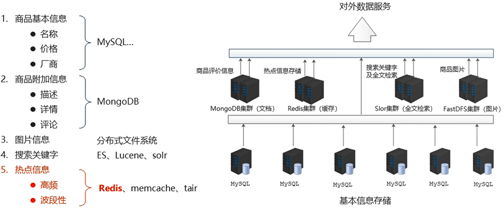
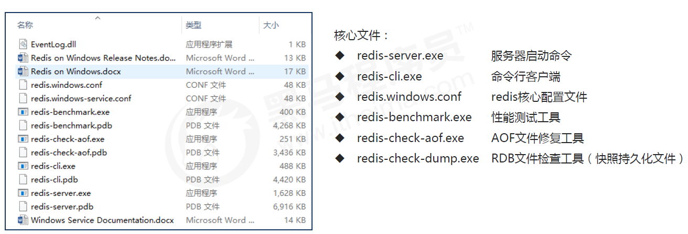
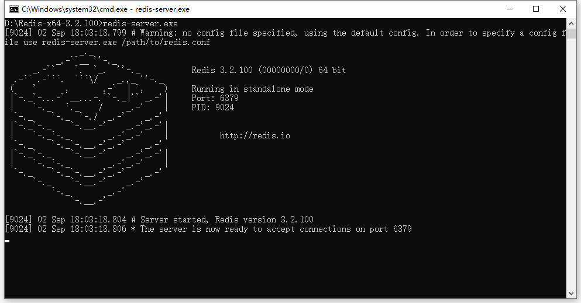
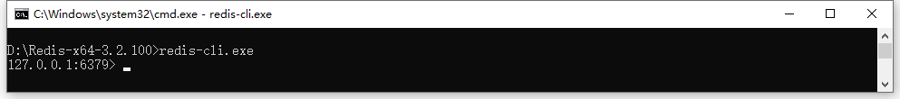
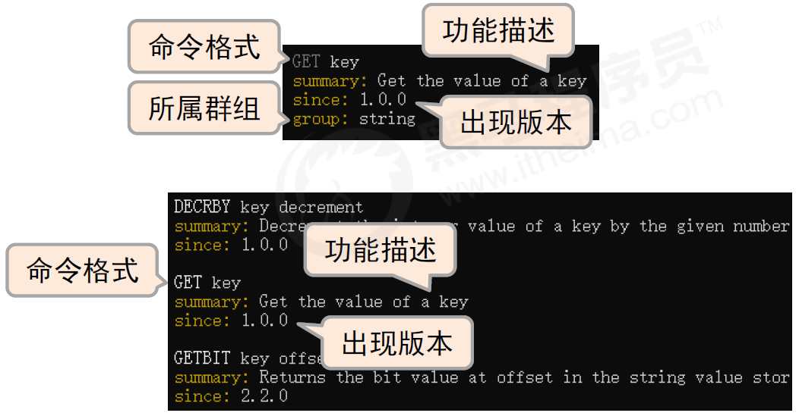

## Redis入门

### Redis 简介

12306	

#### 问题现象

- 海量用户
- 高并发

#### 罪魁祸首——关系型数据库

- 性能瓶颈：磁盘IO性能低下

- 扩展瓶颈：数据关系复杂，扩展性差，不便于大规模集群

#### 解决思路

Nosql：

- 降低磁盘IO次数，越低越好  —— 内存存储
- 去除数据间关系，越简单越好 —— 不存储关系，仅存储数据


#### Nosql

NoSQL：即 Not-Only SQL（ 泛指非关系型的数据库），作为关系型数据库的补充。

作用：应对基于海量用户和海量数据前提下的数据处理问题。

特征：

- 可扩容，可伸缩

- 大数据量下高性能

- 灵活的数据模型

- 高可用

常见 Nosql 数据库：

- Redis
- memcache
- HBase
- MongoDB

#### 解决方案（电商场景）



#### Redis

概念：Redis (REmote DIctionary Server) 是用 C 语言开发的一个开源的高性能键值对（key-value）数据库。

特征：

1. 数据间没有必然的关联关系

2. 内部采用单线程机制进行工作

3. 高性能。官方提供测试数据，50个并发执行100000 个请求,读的速度是110000 次/s,写的速度是81000次/s。

4. 多数据类型支持
   - 字符串类型 	string
   - 列表类型         list
   - 散列类型         hash
   - 集合类型         set
   - 有序集合类型 sorted_set

5. 持久化支持。可以进行数据灾难恢复

#### Redis 的应用

- 为热点数据加速查询（主要场景），如热点商品、热点新闻、热点资讯、推广类等高访问量信息等
- 任务队列，如秒杀、抢购、购票排队等
- 即时信息查询，如各位排行榜、各类网站访问统计、公交到站信息、在线人数信息（聊天室、网站）、设备信号等
- 时效性信息控制，如验证码控制、投票控制等
- 分布式数据共享，如分布式集群架构中的 session 分离
- 消息队列
- 分布式锁

### Redis 的下载与安装

#### Redis 的下载

Linux 版（适用于企业级开发）

- Redis 高级开始使用
- 以4.0 版本作为主版本

Windows 版本（适合零基础学习）

- Redis 入门使用
- 以 3.2 版本作为主版本
- 下载地址：https://github.com/MSOpenTech/redis/tags

#### 安装 Redis



#### 启动 Redis

服务器启动



端口：6379 PID：随机生成

客户端连接



### Redis 的基本操作

#### 命令行模式工具使用思考

- 功能性命令
- 清除屏幕信息
- 帮助信息查阅
- 退出指令

#### 信息添加

- 功能：设置 key，value 数据

- 命令

  ```redis
  set key value
  ```

- 范例

  ```
  set name itheima
  ```

#### 信息查询

- 功能：根据 key 查询对应的 value，如果不存在，返回空（nil）

- 命令

  ```
  get key
  ```

- 范例

  ```
  get name
  ```

#### 清除屏幕信息

- 功能：清除屏幕中的信息

- 命令

  ```
  clear
  ```

#### 退出客户端命令行模式

- 功能：退出客户端

- 命令

  ```
  quit 
  exit 
  <ESC>
  ```

#### 帮助

- 功能：获取命令帮助文档，获取组中所有命令信息名称

- 命令

  ```
  help 命令名称 
  help @组名
  ```

  

### 总结

**Redis 入门**

1. Redis 简介
2. Redis 的下载与安装
3. Redis 的基本操作
- set/get
- clear
- help