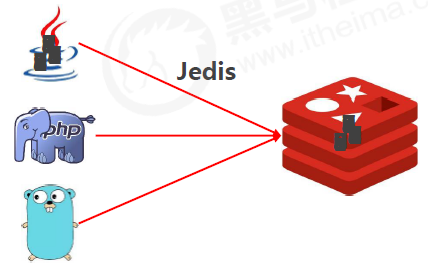
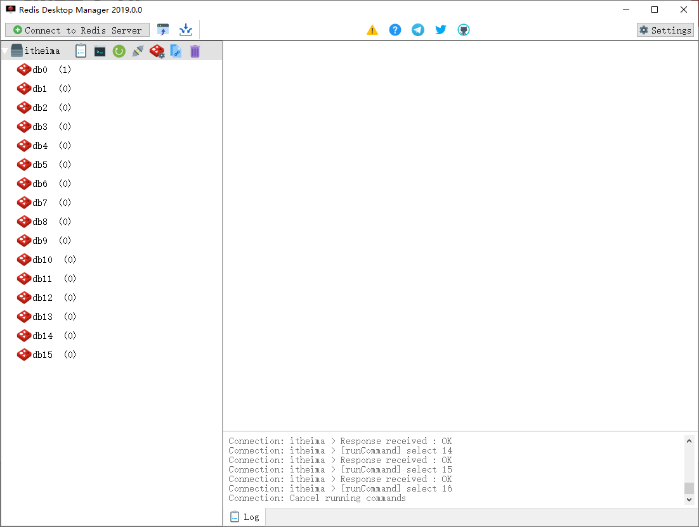

### Jedis简介

#### 编程语言与redis

- Java语言连接redis服务 

  ​	Jedis 

  ​	SpringData Redis 

  ​	Lettuce

- C 、C++ 、C# 、Erlang、Lua 、Objective-C 、Perl 、PHP 、Python 、Ruby 、Scala

- 可视化连接redis客户端 

  ​	Redis Desktop Manager 

  ​	Redis Client 

  ​	Redis Studio

  


### HelloWorld（Jedis版）

#### 准备工作

- jar包导入 

  ​	下载地址：https://mvnrepository.com/artifact/redis.clients/jedis

- 基于maven

  ```xml
  <dependency> 
      <groupId>redis.clients</groupId> 
      <artifactId>jedis</artifactId> 
      <version>2.9.0</version> 
  </dependency>
  ```

#### 客户端连接redis

- 连接redis

  ```java
  Jedis jedis = new Jedis("localhost", 6379);
  ```

- 操作redis

  ```java
  jedis.set("name", "itheima");
  jedis.get("name");
  jedis.lpush("list1","a","b","c");
  List<String> list1 = jedis.lrange("list","0","-1");
  ```

- 关闭redis连接

  ```java
  jedis.close();
  ```

- API文档 

  ​	http://xetorthio.github.io/jedis/

### Jedis读写redis数据

**案例：服务调用次数控制**

人工智能领域的语义识别与自动对话将是未来服务业机器人应答呼叫体系中的重要技术，百度自研用户评价语义识别服务，免费开放给企业试用，同时训练百度自己的模型。现对试用用户的使用行为进行限速，限制每个用户每分钟最多发起10次调用

- 案例要求
  - 设定A、B、C三个用户
  - A用户限制10次/分调用，B用户限制30次/分调用，C用户不限制

**案例：需求分析**

1. 设定一个服务方法，用于模拟实际业务调用的服务，内部采用打印模拟调用
2. 在业务调用前服务调用控制单元，内部使用redis进行控制，参照之前的方案
3. 对调用超限使用异常进行控制，异常处理设定为打印提示信息
4. 主程序启动3个线程，分别表示3种不同用户的调用

**案例：实现步骤**

1. 设定业务方法

   ```java
   void business(String id,long num){ 
       System.out.println("用户"+id+"发起业务调用，当前第"+num+"次"); 
   }
   ```

2. 设定多线类，模拟用户调用

   ```java
   public void run(){ 
       while(true){ 
           jd.service(id); 
           //模拟调用间隔，设定为1.x秒 
           try{ 
               Random r = new Random(); 
               Thread.sleep(1000+ r.nextInt(200)); 
           }catch (InterruptedException e){ 
               e.printStackTrace();
           } 
       } 
   }
   ```

3. 设计redis控制方案

   ```java
   void service(String id){ 
       Jedis jedis = new Jedis("localhost", 6379); 
       String value = jedis.get("compid:" + id); 
       //判定是否具有调用计数控制，利用异常进行控制处理 
       if(value == null) { 
           //没有控制，创建控制计数器 
           jedis.setex("compid:" + id, 20, ""+(Long.MAX_VALUE-10)); 
       }else{ 
           //有控制，自增，并调用业务 
           try{ 
               Long val = jedis.incr("compid:"+id); 
               business(id,10+val-Long.MAX_VALUE); 
           }catch (JedisDataException e){ 
               //调用次数溢出，弹出提示 
               System.out.println("用户："+id+"使用次数已达到上限，请稍后再试，或升级VIP会员"); 
               return; 
           }finally{ 
               jedis.close(); 
           } 
       } 
   }
   ```

4. 设计启动主程序

   ```java
   public static void main(String[] args) { 
       MyThread t1 = new MyThread("初级用户"); 
       t1.start(); 
   }
   ```

   后续1：对业务控制方案进行改造，设定不同用户等级的判定 

   后续2：将不同用户等级对应的信息、限制次数等设定到redis中，使用hash保存

### Jedis简易工具类开发

#### 基于连接池获取连接
- JedisPool：Jedis提供的连接池技术 

  ​	poolConfig:连接池配置对象 

  ​	host:redis服务地址 

  ​	port:redis服务端口号

  ```java
  public JedisPool(GenericObjectPoolConfig poolConfig, String host, int port) { 
      this(poolConfig, host, port, 2000, (String)null, 0, (String)null); 
  }
  ```

#### 封装连接参数

- jedis.properties

  ```properties
  jedis.host=localhost 
  jedis.port=6379 
  jedis.maxTotal=30 
  jedis.maxIdle=10
  ```

#### 加载配置信息

- 静态代码块初始化资源

  ```java
  static{ 
      //读取配置文件 获得参数值 
      ResourceBundle rb = ResourceBundle.getBundle("jedis"); 
      host = rb.getString("jedis.host"); 
      port = Integer.parseInt(rb.getString("jedis.port")); 
      maxTotal = Integer.parseInt(rb.getString("jedis.maxTotal")); 
      maxIdle = Integer.parseInt(rb.getString("jedis.maxIdle")); 
      poolConfig = new JedisPoolConfig(); 
      poolConfig.setMaxTotal(maxTotal); 
      poolConfig.setMaxIdle(maxIdle); 
      jedisPool = new JedisPool(poolConfig,host,port); 
  }
  ```

#### 获取连接

- 对外访问接口，提供jedis连接对象，连接从连接池获取

  ```java
  public static Jedis getJedis(){ 
      Jedis jedis = jedisPool.getResource(); 
      return jedis; 
  }
  ```

### 可视化客户端

#### Redis Desktop Manager

