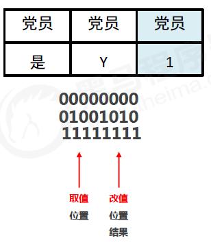
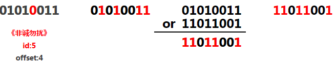
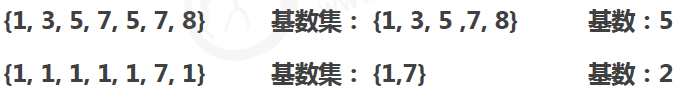
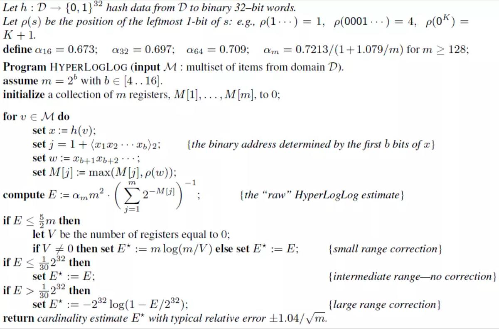

### Bitmaps

公司的年度总结会


公司的年度总结会第二天


#### 存储需求



#### Bitmaps类型的基础操作

- 获取指定key对应偏移量上的bit值

  ```
  getbit key offset
  ```

- 设置指定key对应偏移量上的bit值，value只能是1或0

  ```
  setbit key offset value
  ```

#### Bitmaps类型的扩展操作

**业务场景**

电影网站

- 统计每天某一部电影是否被点播
- 统计每天有多少部电影被点播
- 统计每周/月/年有多少部电影被点播
- 统计年度哪部电影没有被点播

**业务分析**




- 对指定key按位进行交、并、非、异或操作，并将结果保存到destKey中

  ```
  bitop op destKey key1 [key2...]
  ```

  - and：交

  - or：并

  - not：非

  - xor：异或


- 统计指定key中1的数量

  ```
  bitcount key [start end]
  ```

Tips 21：

- redis 应用于信息状态统计

### HyperLogLog

#### 统计独立UV

- 原始方案：set
  - 存储每个用户的id（字符串）
- 改进方案：Bitmaps
  - 存储每个用户状态（bit）
- 全新的方案：Hyperloglog

#### 基数

- 基数是数据集去重后元素个数
- HyperLogLog 是用来做基数统计的，运用了LogLog的算法



#### LogLog算法



#### HyperLogLog类型的基本操作

- 添加数据

  ```
  pfadd key element [element ...]
  ```

- 统计数据

  ```
  pfcount key [key ...]
  ```

- 合并数据

  ```
  pfmerge destkey sourcekey [sourcekey...]
  ```

Tips 22：

- redis 应用于独立信息统计

#### 相关说明

- 用于进行基数统计，不是集合，不保存数据，只记录数量而不是具体数据
- 核心是基数估算算法，最终数值存在一定误差
- 误差范围：基数估计的结果是一个带有 0.81% 标准错误的近似值
- 耗空间极小，每个hyperloglog key占用了12K的内存用于标记基数
- pfadd命令不是一次性分配12K内存使用，会随着基数的增加内存逐渐增大
- Pfmerge命令合并后占用的存储空间为12K，无论合并之前数据量多少

### GEO

#### 火热的生活服务类软件

- 微信 / 陌陌
- 美团 / 饿了么
- 携程 / 马蜂窝
- 高德 / 百度
- ……

#### GEO类型的基本操作

- 添加坐标点

  ```
  geoadd key longitude latitude member [longitude latitude member ...]
  ```

- 获取坐标点

  ```
  geopos key member [member ...]
  ```

- 计算坐标点距离

  ```
  geodist key member1 member2 [unit]
  ```

- 添加坐标点

  ```
  georadius key longitude latitude radius m|km|ft|mi [withcoord] [withdist] [withhash] [count count]
  ```

- 获取坐标点

  ```
  georadiusbymember key member radius m|km|ft|mi [withcoord] [withdist] [withhash] [count count]
  ```

- 计算经纬度

  ```
  geohash key member [member ...]
  ```


Tips 23：

- redis 应用于地理位置计算

