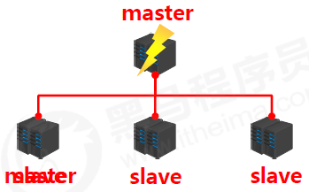
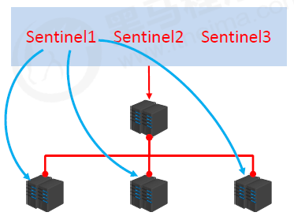
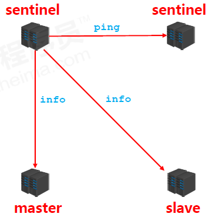
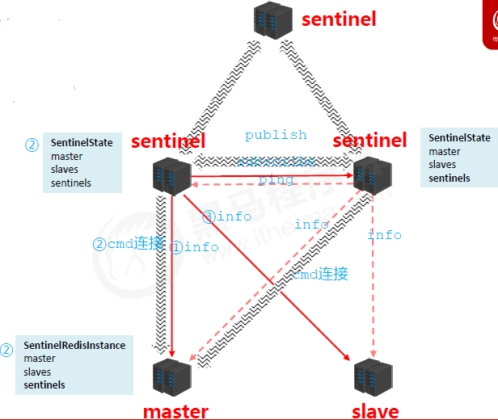
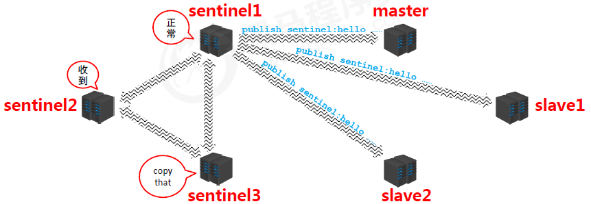
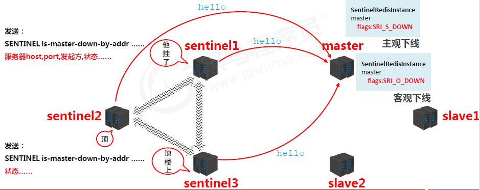
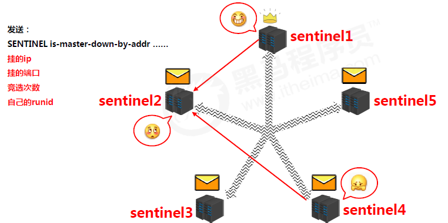

### 哨兵简介

#### 主机“宕机”



- 关闭master和所有slave
- 找一个slave作为master
- 修改其他slave的配置，连接新的主
- 启动新的master与slave
- 全量复制*N+部分复制*N
- 关闭期间的数据服务谁来承接？
- 找一个主？怎么找法？
- 修改配置后，原始的主恢复了怎么办？

#### 哨兵

哨兵(sentinel) 是一个分布式系统，用于对主从结构中的每台服务器进行监控，当出现故障时通过投票机制选择新的master并将所有slave连接到新的master。



#### 哨兵的作用

- 监控 
  - 不断的检查master和slave是否正常运行。 
  - master存活检测、master与slave运行情况检测
- 通知（提醒） 
  - 当被监控的服务器出现问题时，向其他（哨兵间，客户端）发送通知。
- 自动故障转移 
  - 断开master与slave连接，选取一个slave作为master，将其他slave连接到新的master，并告知客户端新的服务器地址 

> 注意： 哨兵也是一台redis服务器，只是不提供数据服务 通常哨兵配置数量为单数

### 启用哨兵模式

#### 配置哨兵
- 配置一拖二的主从结构

- 配置三个哨兵（配置相同，端口不同）

  -  参看sentinel.conf

- 启动哨兵

  ```
  redis-sentinel sentinel-端口号.conf
  ```

  | 配置项                                                       | 范例                                             | 说明                                                         |
  | ------------------------------------------------------------ | ------------------------------------------------ | ------------------------------------------------------------ |
  | sentinel auth-pass <服务器名称> <password>                   | sentinel auth-pass mymaster itcast               | 连接服务器口令                                               |
  | sentinel down-after-milliseconds <自定义服务名称><主机地址><端口><主从服务器总量> | sentinel monitor mymaster 192.168.194.131 6381 1 | 设置哨兵监听的主服务器信息，最后的参数决定了最终参与选举的服务器数量（-1） |
  | sentinel down-after-milliseconds<服务名称><毫秒数（整数）>   | sentinel down-after-milliseconds mymaster 3000   | 指定哨兵在监控Redis服务时，判定服务器挂掉的时间周期，默认30秒（30000），也是主从切换的启动条件之一 |
  | sentinel parallel-syncs<服务名称><服务器数（整数）>          | sentinel parallel-syncs mymaster 1               | 指定同时进行主从的slave数量，数值越大，要求网络资源越高，要求约小，同步时间约长 |
  | sentinel failover-timeout<服务名称><毫秒数（整数）>          | sentinel failover-timeout mymaster 9000          | 指定出现故障后，故障切换的最大超时时间，超过该值，认定切换失败，默认3分钟 |
  | sentinel notification-script<服务名称><脚本路径>             |                                                  | 服务器无法正常联通时，设定的执行脚本，通常调试使用。         |

### 哨兵工作原理

#### 主从切换

- 哨兵在进行主从切换过程中经历三个阶段
  - 监控
  - 通知
  - 故障转移

#### 阶段一：监控阶段

- 用于同步各个节点的状态信息
  - 获取各个sentinel的状态（是否在线）
  - 获取master的状态
    - master属性
      - runid
      - role：master
    - 各个slave的详细信息
  - 获取所有slave的状态（根据master中的slave信息）
    - slave属性
      - runid
      - role：slave
      - master_host、master_port
      - offset
      - ……





#### 阶段二：通知阶段



#### 阶段三：故障转移阶段





- 服务器列表中挑选备选master
  - 在线的
  - 响应慢的（pass）
  - 与原master断开时间久的（pass）
  - 优先原则
    - 优先级
    - offset
    - runid
- 发送指令（ sentinel ）
  - 向新的master发送slaveof no one
  - 向其他slave发送slaveof 新masterIP端口

#### 主从切换总结

- 服务器列表中挑选备选master
- 在线的
- 响应慢的
- 与原master断开时间久的
- 优先原则
  - 优先级
  - offset
  - runid

#### 阶段三：故障转移阶段

- 监控
  - 同步信息
- 通知
  - 保持联通
- 故障转移
  - 发现问题
  - 竞选负责人
  - 优选新master
  - 新master上任，其他slave切换master，原master作为slave故障回复后连接