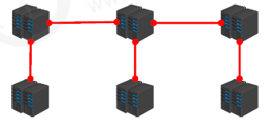
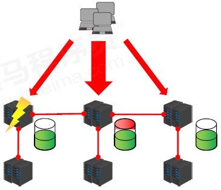
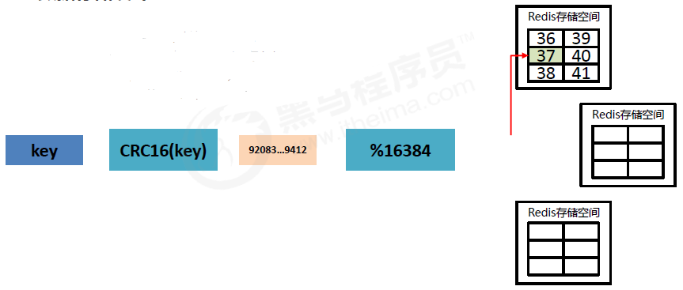
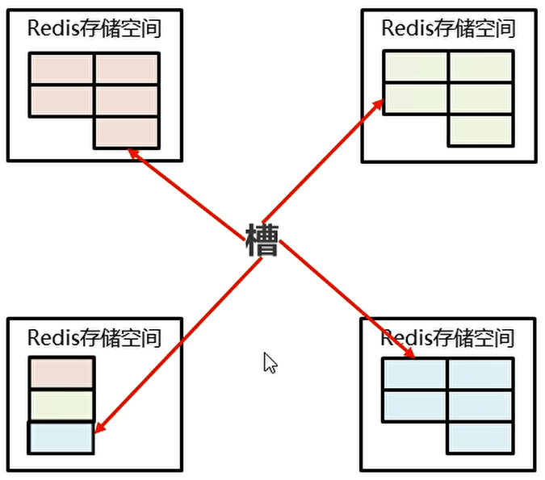
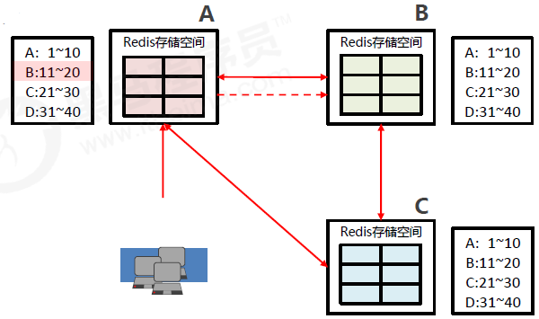

### 集群简介

#### 现状问题

业务发展过程中遇到的峰值瓶颈

- redis提供的服务OPS可以达到10万/秒，当前业务OPS已经达到10万/秒
- 内存单机容量达到256G，当前业务需求内存容量1T
- 使用集群的方式可以快速解决上述问题

#### 集群架构

- 集群就是使用网络将若干台计算机联通起来，并提供统一的管理方式，使其对外呈现单机的服务效果



#### 集群作用

- 分散单台服务器的访问压力，实现负载均衡
- 分散单台服务器的存储压力，实现可扩展性
- 降低单台服务器宕机带来的业务灾难



### Redis集群结构设计

#### 数据存储设计

- 通过算法设计，计算出key应该保存的位置
- 将所有的存储空间计划切割成16384份，每台主机保存一部分 
  - 每份代表的是一个存储空间，不是一个key的保存空间
- 将key按照计算出的结果放到对应的存储空间



- 增强可扩展性



#### 集群内部通讯设计

- 各个数据库相互通信，保存各个库中槽的编号数据
- 一次命中，直接返回
- 一次未命中，告知具体位置




### cluster集群结构搭建(没认真看)

#### 搭建方式

- 原生安装（单条命令）
  - 配置服务器（3主3从）
  - 建立通信（Meet）
  - 分槽（Slot）
  - 搭建主从（master-slave）
- 工具安装（批处理）

#### Cluster配置

- 添加节点

  ```
  cluster-enabled yes|no
  ```

- cluster配置文件名，该文件属于自动生成，仅用于快速查找文件并查询文件内容

  ```
  cluster-config-file <filename>
  #cluster-config-file node-6379.conf
  ```

- 节点服务响应超时时间，用于判定该节点是否下线或切换为从节点

  ```
  cluster-node-timeout <milliseconds>
  ```

- master连接的slave最小数量

  ```
  cluster-migration-barrier <count>
  ```

#### Cluster节点操作命令

- 查看集群节点信息

  ```
  cluster nodes
  ```

- 进入一个从节点 redis，切换其主节点

  ```
  cluster replicate <master-id>
  ```

- 发现一个新节点，新增主节点

  ```
  cluster meet ip:port
  ```

- 忽略一个没有solt的节点

  ```
  cluster forget <id>
  ```

- 手动故障转移

  ```
  cluster failover
  ```

#### redis-trib命令

- 添加节点

  ```
  redis-trib.rb add-node
  ```

- 删除节点

  ```
  redis-trib.rb del-node  
  ```

- 重新分片

  ```
  redis-trib.rb reshard
  ```
